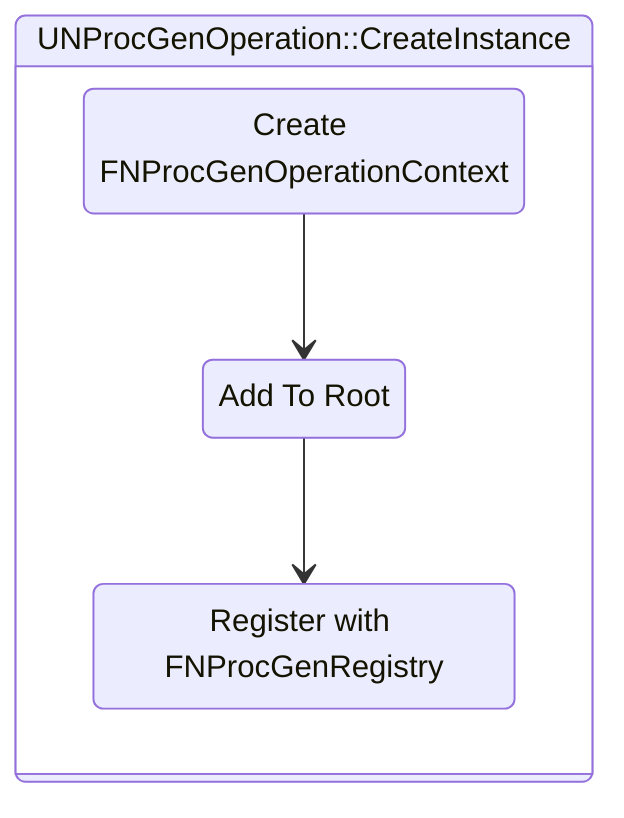

# Pre-Generation

`UNProcGenOperation::CreateInstance()`

```mermaid
stateDiagram-v2

  state UNProcGenOperation::CreateInstance {
    
    Context : Create FNProcGenOperationContext   
    AddToRoot : Add To Root  
    Register : Register with FNProcGenRegistry 

    Context --> AddToRoot    
    AddToRoot --> Register
  }
  
  
```