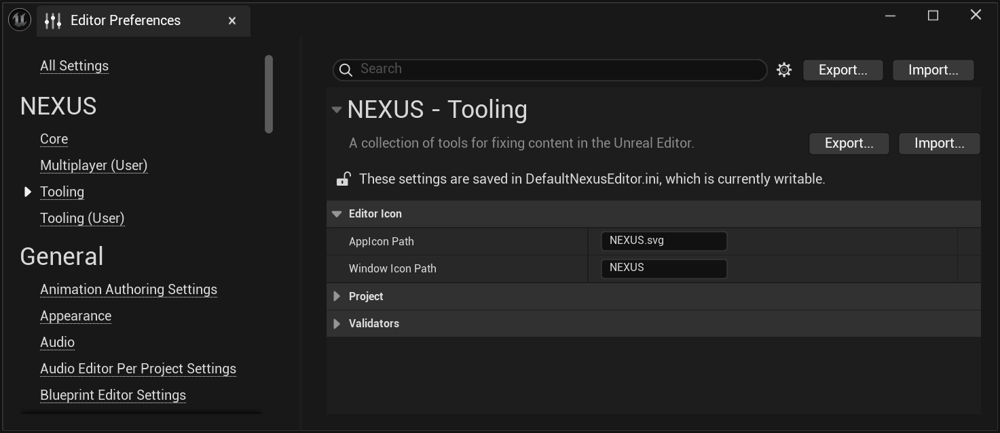

# Editor Window Icon

Overrides the Unreal Editor icon with user-defined icons. While available to source users, through replacing the actual content files used, this feature presents a non-destructive option to customize both the Unreal Editor's internal theme icon, as well as the window icon registered with Windows.

**Theme Icon**

**Window Icon**

## Settings

The settings for customizing the icons are found in the Editor Preferences under  `NEXUS > Core > Editor Icon`.

| Setting | Description |
| --- | :-- |
| `AppIcon Path` | Replaces the Starship AppIcon style, can be in SVG or image format. This path is relative to the project root! |
| `Window Icon Path` | Replaces the Unreal Editor window icon at a platform level. This should simply be the path to the file WITHOUT any extension. The extension will be determined by the platform, thus all resources should have the same base name, and be located in the same folder. This path is relative to the project root! |

:::info

A restart of the editor is required for any of these changes to take effect.

:::

:::tip

You can see that the [Test Project](../../../getting-started/test-project.md) exercises this functionality, referencing both `NEXUS.svg` and `NEXUS.ico` in it's preferences.

:::
