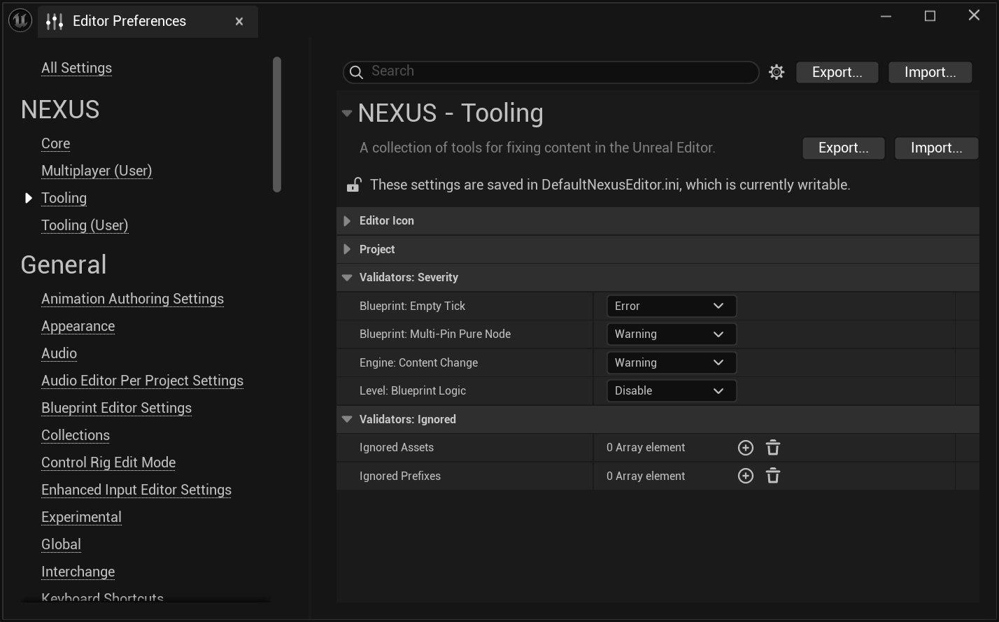

import ContributorLink from '../../../../src/components/ContributorLink'

# Blueprint Validator

An opinionated set of validation for `UBlueprints`.

## IsEmptyTick

The _hidden_ performance killer, the **empty tick**. This function of the `UNBlueprintValidator` evaluates a `UBlueprint` for any Tick events that are not disabled, and have no actual logic following them.

### Severity

By default, the severity of this validation is set to `Error` due to its direct performance impact and relative ease of resolution. Should you wish to change the level (or disable) of this validation, it can be found in the 
project-wide in `Editor Preferences > NEXUS > Tooling > Blueprint: Empty Tick`

## IsMultiPinPureNode

One of the older traps of development is accessing properties, and the hidden cost of accessing the output value. Often, developers will not evaluate the underlying backing of the property and reason whether that property should be cached locally in that frame instead of accessing it repeatedly. This problem gets exacerbated by the multi-pin pure node accessing that can happen with a `UBlueprint`.

This function of the `UNBlueprintValidator` looks for occurances where this occurs.

:::tip

<ContributorLink id="reapazor" /> wrote a [blog](https://reapazor.com/2025/06/25/multipin-pure-nodes-validator-woes/) post explaining why this is an important validator to pay attention too, and how to easily solve the raised concerns.

:::

### Severity

By default, the severity of this validation is set to `Warning`, as it will not break your project, and resolving it requires some cognitive load.

:::info

Anecdotally, we have heard of developers getting actual FPS boosts from refactoring their `UBlueprints` with this knowledge in hand.

:::