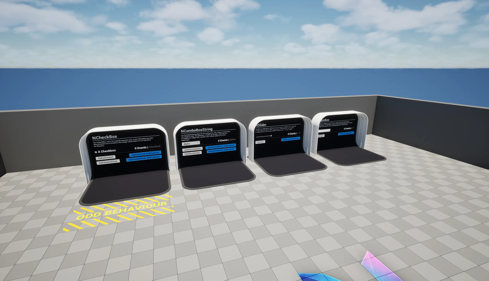

# Samples

The `DEMO_NUI` sample map is available once you have enabled the `NEXUS Samples: UI` plugin. This is found in the `NEXUS Samples` category in the `Edit > Plugins` window.

The map demonstrates all of the provided [widgets](../widgets).
