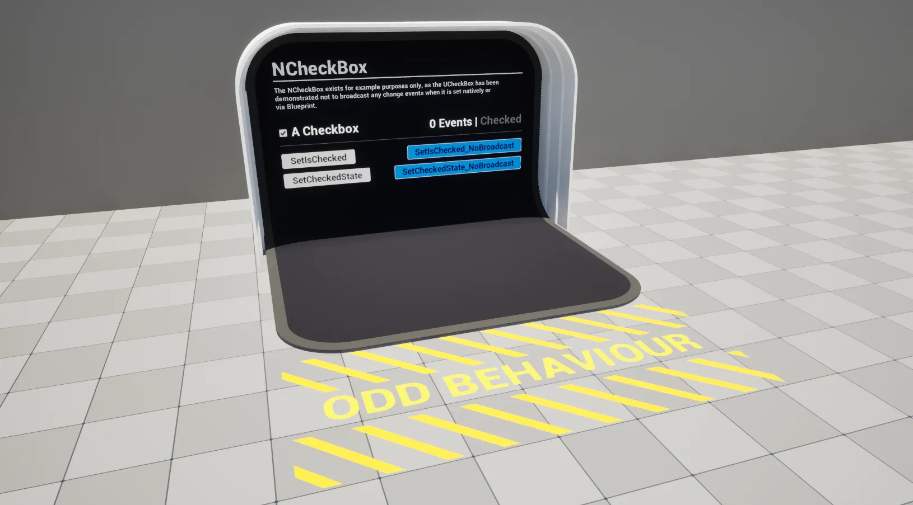

import TypeDetails from '../../../../src/components/TypeDetails';

# CheckBox

<TypeDetails icon="ue-widget" base="UCheckBox" type="UNCheckBox" typeExtra="" headerFile="NexusUI/Public/Components/NCheckBox.h" />



An extension on the UMG `UCheckBox` which adds functionality to set its value without broadcasting / triggering events, **or so we thought**.

:::warning

The `UCheckBox` does not trigger events when it is altered. It does not match the tradition UMG trope for some reason.

:::

## UFunctions

### Set IsChecked (No Broadcast)
```cpp
	/**
	 * Sets if the UCheckBox is checked without triggering exposed event bindings.
	 * @param bNewValue The new value.
	 */
	void SetIsChecked_NoBroadcast(const bool bNewValue);
```

### Set CheckedState (No Broadcast)

```cpp
	/**
	 * Set the checked state of the UCheckBox without triggering exposed event bindings.	
	 * @param NewState The new value.
	 */
	void SetCheckedState_NoBroadcast(const ECheckBoxState NewState);
```