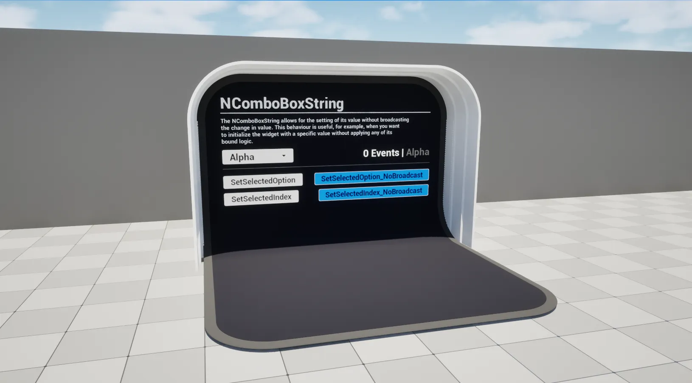

import TypeDetails from '../../../../src/components/TypeDetails';

# ComboBox String

<TypeDetails icon="ue-widget" base="UComboBoxString" type="UNComboBoxString" typeExtra="" headerFile="NexusUI/Public/Components/NComboBoxString.h" />



An extension on the UMG `UComboBoxString` which adds functionality to set its selected option or index without broadcasting / triggering events.

## UFunctions

### Set Selected Option (No Broadcast)

```cpp
/**
  * Sets the selected option of the UComboBoxString without triggering exposed event bindings.
  * @param Option The new option's text.
  */
void SetSelectedOption_NoBroadcast(FString Option);
```

### Set Selected Index (No Broadcast)

```cpp
/**
  * Sets the selected option by index of the UComboBoxString without triggering exposed event bindings.	 
  * @param Index The new option's index.
  */
void SetSelectedIndex_NoBroadcast(const int32 Index);
```  