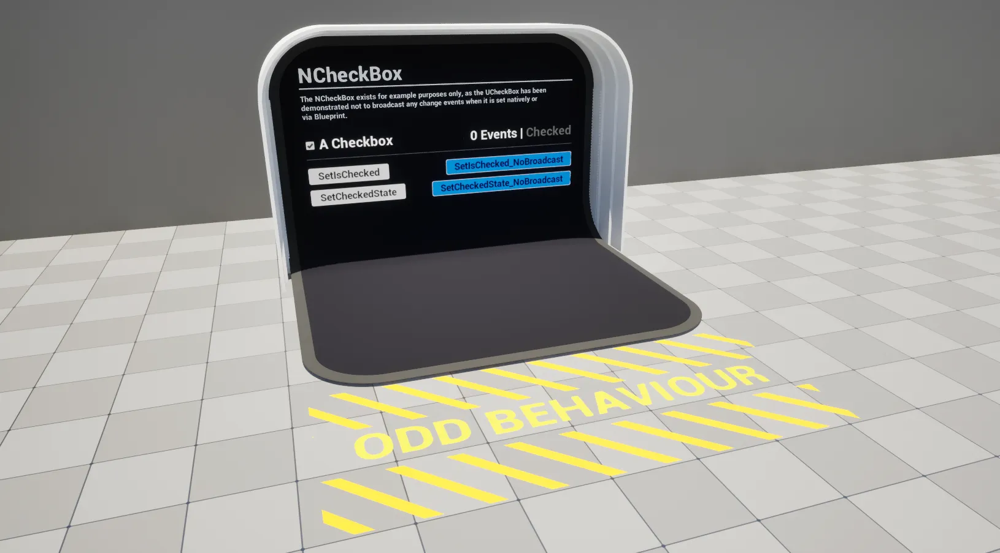

import TypeDetails from '../../../../../src/components/TypeDetails';

# CheckBox

<TypeDetails icon="ue-widget" base="UCheckBox" type="UNCheckBox" typeExtra="" headerFile="NexusUI/Public/Components/NCheckBox.h" />



An extension on the UMG `UCheckBox` which adds functionality to set its value without broadcasting / triggering events, **or so we thought**. The `_NoBroadcast` setters are kept for API symmetry with the rest of the no-broadcast widgets ([Slider](slider.md), [SpinBox](spin-box.md), [ComboBox String](combobox-string.md)) — see the [FAQ](../../faq.md) for the broader rationale.

:::warning

The stock `UCheckBox` does **not** trigger events when its value is altered programmatically — it does not follow the usual UMG pattern of re-firing handlers on `SetIsChecked`. The wrapped methods below are functionally identical to the base class setters, but exist so you can write the same call shape across all NEXUS-extended widgets.

:::

## UFunctions

### Set IsChecked (No Broadcast)
```cpp
	/**
	 * Sets if the UCheckBox is checked without triggering exposed event bindings.
	 * @param bNewValue The new value.
	 */
	void SetIsChecked_NoBroadcast(const bool bNewValue);
```

### Set CheckedState (No Broadcast)

```cpp
	/**
	 * Set the checked state of the UCheckBox without triggering exposed event bindings.	
	 * @param NewState The new value.
	 */
	void SetCheckedState_NoBroadcast(const ECheckBoxState NewState);
```