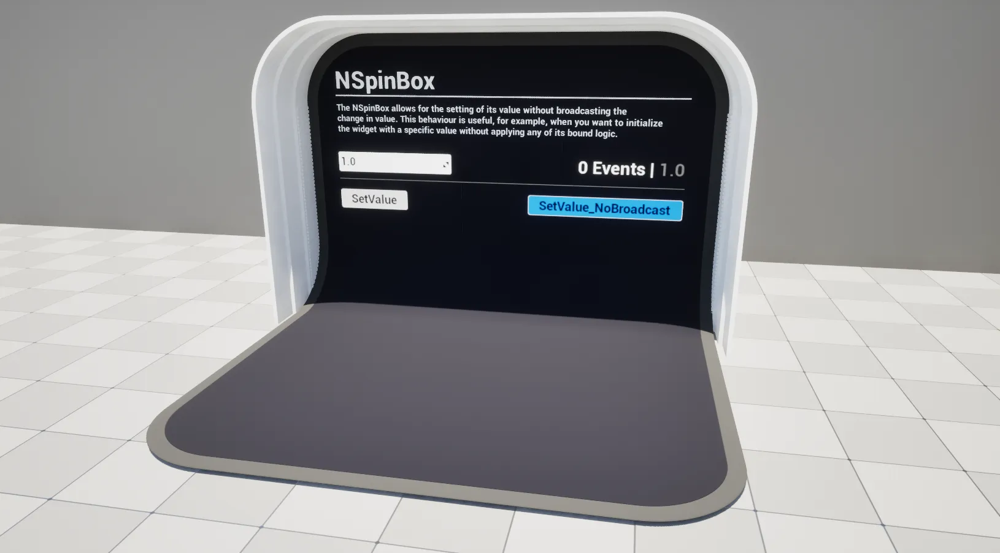

import TypeDetails from '../../../../src/components/TypeDetails';

# SpinBox

<TypeDetails icon="ue-widget" base="USpinBox" type="UNSpinBox" typeExtra="" headerFile="NexusUI/Public/Components/NSpinBox.h" />



An extension on the UMG `USpinBox` which adds functionality to set its value without broadcasting / triggering events.

## UFunctions

### Set Value (No Broadcast)

```cpp
/**
  * Set the value of the USpinBox without triggering exposed event bindings.
  * @param NewValue The new value.
  */
void SetValue_NoBroadcast(const float NewValue);
```