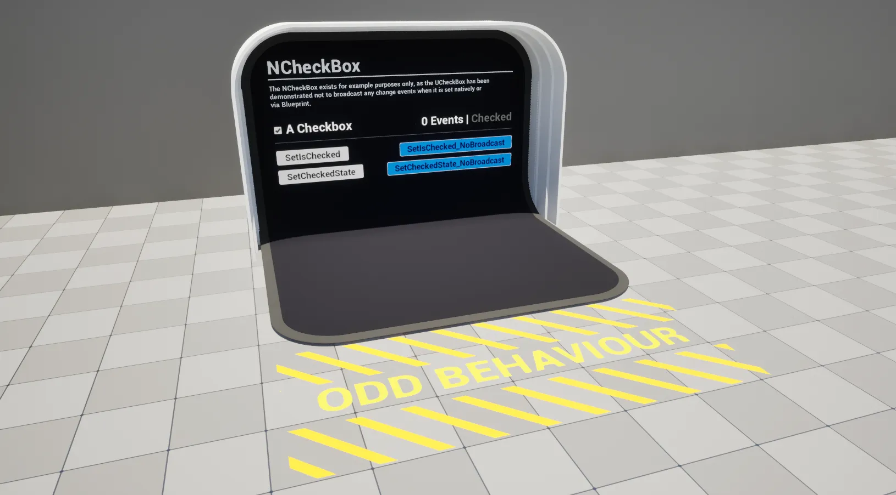

import TypeDetails from '../../../../src/components/TypeDetails';

# CheckBox

<TypeDetails icon="ue-widget" base="UCheckBox" type="UNCheckBox" typeExtra="" headerFile="NexusUI/Public/NCheckBox.h" />



An extension on the UMG `UCheckBox` which adds functionality to set its value without broadcasting / triggering events, **or so we thought**.

```cpp
UFUNCTION(BlueprintCallable, Category="NEXUS|User Interface", DisplayName="Set Is Checked (No Broadcast)")
void SetIsChecked_NoBroadcast(const bool bNewValue);

UFUNCTION(BlueprintCallable, Category="NEXUS|User Interface", DisplayName="Set Chcked State (No Broadcast)")
void SetCheckedState_NoBroadcast(const ECheckBoxState NewState);
```

:::warning

The `UCheckBox` does not trigger events when it is altered. It does not match the tradition UMG trope for some reason.

:::