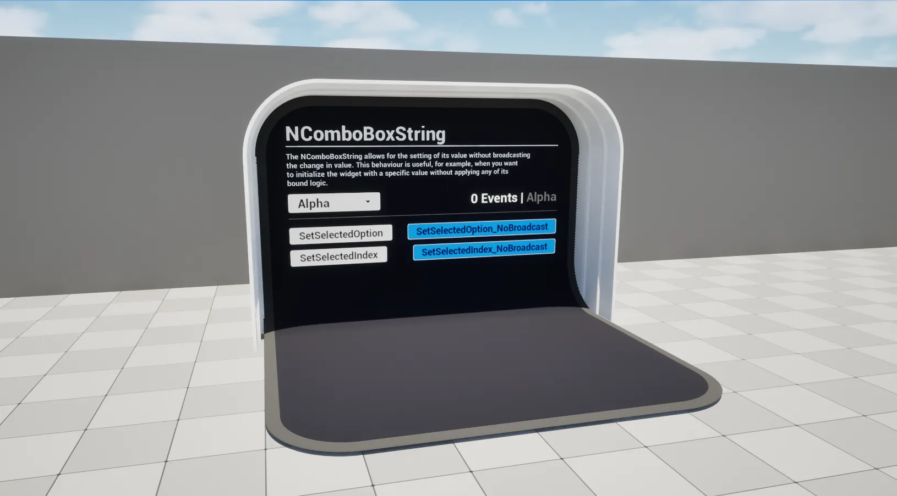

import TypeDetails from '../../../../src/components/TypeDetails';

# ComboBoxString

<TypeDetails icon="ue-widget" base="UComboBoxString" type="UNComboBoxString" typeExtra="" headerFile="NexusUI/Public/NComboBoxString.h" />



An extension on the UMG `UComboBoxString` which adds functionality to set its selected option or index without broadcasting / triggering events.

```cpp
UFUNCTION(BlueprintCallable, Category="NEXUS|User Interface", DisplayName="Set Selected Option (No Broadcast)")
void SetSelectedOption_NoBroadcast(FString Option);

UFUNCTION(BlueprintCallable, Category="NEXUS|User Interface", DisplayName="Set Selected Index (No Broadcast)")
void SetSelectedIndex_NoBroadcast(const int32 Index);
```  