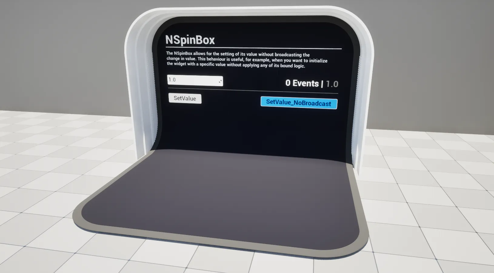

import TypeDetails from '../../../../src/components/TypeDetails';

# SpinBox

<TypeDetails icon="ue-widget" base="USpinBox" type="UNSpinBox" typeExtra="" headerFile="NexusUI/Public/NSpinBox.h" />



An extension on the UMG `USpinBox` which adds functionality to set its value without broadcasting / triggering events.

```cpp
UFUNCTION(BlueprintCallable, Category="NEXUS|User Interface", DisplayName="Set Value (No Broadcast)")
void SetValue_NoBroadcast(const float NewValue);
```