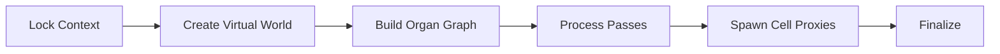

import DocCardList from '@theme/DocCardList';

# Architecture

How an assembly operation actually runs, for contributors and anyone extending the pipeline. Everything here is **internal** — none of it is Blueprint-exposed, and none of it is needed to *use* World Assembly. For that, start at [Process Flows](../process-flows.md), which walks the same pipeline from the outside.

## The Shape Of A Run

An [Assembly Operation](../types/assembly-operation.md) is a coordinator, not a worker. Once its context is locked it hands the actual work to a task graph, and the pipeline moves through four broad stages:

Two ideas explain most of the design:

**Nothing touches the live world until the end.** Generation runs against a *virtual* representation — cell bounds, hulls, and voxel data read from side-car assets — so the expensive part never loads a level. Real content only appears in the [Spawn Cell Proxies](tasks.md) stage, and even then as [proxies](../types/cell-proxy.md) that stream their levels in behind a preview mesh.

**The game thread is a scarce resource.** The graph builder runs off-thread, which is why the pipeline snapshots what it needs into contexts up front rather than reaching into the [Registry](../types/world-assembly-registry.md) — that registry is game-thread only.

## Determinism

Every placement decision is drawn from a seeded [Mersenne Twister](../../core/types/math/mersenne-twister.md) stream. That is what makes a seed reproducible, and it is also why several APIs insist on sorted input — the *order* decisions are made in is part of the result. Where a contract depends on ordering, the page for that stage says so.

<DocCardList />
