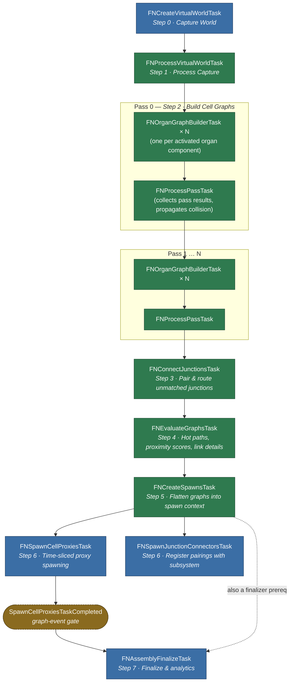

# Tasks

The work an [Assembly Operation](../types/assembly-operation.md) actually performs, split into task-graph jobs. Each is an internal native struct or class under `Assembly/Tasks/`; none is Blueprint-exposed.

The single most important property of this set is **which thread each job runs on**, because that is what decides how much of a generation run can happen off the game thread.

## The Jobs

| Task | Thread | Purpose |
| :-- | :-- | :-- |
| `FNCreateVirtualWorldTask` | **Game thread** | Snapshots the target world into a virtual world context. |
| `FNProcessVirtualWorldTask` | Any worker | Transforms that snapshot into the form the collision checks expect. |
| `FNOrganGraphBuilderTask` | Background worker | Builds the assembly graph for one organ. |
| `FNProcessPassTask` | Any worker | Promotes a pass's graphs to the top-level context and publishes their hulls. |
| `FNConnectJunctionsTask` | Any worker | Pairs unmatched junctions and routes a collision-free path between each pair. |
| `FNEvaluateGraphsTask` | Any worker | Resolves hot paths, scores cell proximity, and generates per-junction link details. |
| `FNCreateSpawnsTask` | Any worker | Flattens per-organ graphs into a single cell-node spawn list. |
| `FNSpawnCellProxiesTask` | **Game thread** | Spawns [Cell Proxy](../types/cell-proxy.md) actors, time-sliced. |
| `FNSpawnJunctionConnectorsTask` | **Game thread** | Hands accepted junction pairings to the [subsystem](../types/world-assembly-subsystem.md#junction-connectors). |
| `FNAssemblyFinalizeTask` | **Game thread** | Notifies the operation the graph has drained. |

Only four are pinned to the game thread, and each for a concrete engine reason rather than convenience.

## Why The Game-Thread Jobs Are Pinned

**`FNCreateVirtualWorldTask`** walks live `AActor`s to gather their simple-collision meshes and transforms. Those queries are not safe from a worker thread, so the snapshot must be taken on the game thread — which is precisely why it is a *snapshot*. Everything downstream reads the copy.

It also filters as it gathers, and the filter is part structural and part authored:

| Excluded | By |
| :-- | :-- |
| Every `AVolume` | Structural. Volumes are *inputs* to generation — organ bounds, exclusions — not collision to avoid. |
| Every `ANDebugActor` | Structural. Debug visualisation is not world geometry. |
| Terrain authoring apparatus | Structural. A terrain modifier describes *how* a terrain is built; its bounds are its region of influence, not a surface. |
| Actors tagged [`NWorldCollision_Ignore`](../tagging.md#world-collision-markup-tags) | Structural. The per-actor opt-out. |
| Actors carrying any configured [`Actor Ignore Tags`](../project-settings.md#assembly) entry | Project setting; empty by default. |
| Actors with collision disabled | [`Exclude Non-Collision Enabled Actors`](../project-settings.md#assembly); `true` by default. |

The distinction matters because the structural exclusions cannot be overridden — a level designer cannot make an organ volume act as collision by tagging it — while the settings-driven ones are the knobs for tuning what a given project treats as an obstacle.

The terrain exclusion is the one worth understanding, because it excludes *apparatus* and not terrain. The editor's [collision visualizer](../editor-mode/world.md#visualizers) and the author-time penetration cache both gather through this same predicate, so a phantom obstacle here would be drawn as world collision *and* avoided during assembly — and a modifier's box has measured larger than every piece of real geometry in a level put together. Terrain **surface** still contributes; a landscape reaches this snapshot by [sampling](../project-settings.md#landscape-is-sampled-rather-than-read) rather than through its collision, which lives behind no body setup.

Player starts run the other way: [`Include Player Starts`](../project-settings.md#assembly) is `true` by default, so they are captured *as* collision and generation places cells around them rather than on top of them.

**`FNSpawnCellProxiesTask`** spawns actors, which the engine only permits on the game thread. It drains a **time-sliced batch** per invocation rather than all pending nodes, and signals its completion event once the spawn context's cursor reaches the end of the list. That is what keeps a large generation from stalling a frame.

**`FNSpawnJunctionConnectorsTask`** touches the [World Assembly Subsystem](../types/world-assembly-subsystem.md#junction-connectors) and the asset manager. It is cheap enough not to warrant a slice of its own, so it rides alongside `FNSpawnCellProxiesTask`.

**`FNAssemblyFinalizeTask`** fires the operation's completion delegates and unlinks the task-graph context. Delegates may reach into gameplay or UI, so it runs where that is safe.

## The Off-Thread Work

`FNOrganGraphBuilderTask` is where generation actually happens. It builds one organ's graph using the **Frontier model** — expanding outward from each bone, consuming open junctions, until none remain or the organ's bounds or cell limits are hit. One task per organ, so independent organs build in parallel.

A builder is only created for components whose `SourceComponent->bActivated` is true — an inactive organ is skipped entirely rather than built and discarded. A pass containing nothing but inactive components still increments the pass counter but adds no tasks to the graph.

A build that succeeds also writes two things back into the [task-graph context](task-graph.md#task-graph-context) keyed by its organ's identifier: the cell count it produced, and the **random-stream state its successful attempt started from**. Both are drained back onto the source [Organ Component](../types/organ-component.md) on the game thread once the graph completes, which is what lets an organ report what it generated without the game thread ever reaching into the build.

The saved state is the *winning attempt's* starting point, not the stream's final position — the stream runs continuously across retries, so replaying from there reproduces the graph that shipped without re-running the attempts that failed.

`FNProcessPassTask` runs between passes: it moves the graphs a pass produced up to the top-level context and adds their cell hulls to the world context, so the *next* pass treats already-placed cells as collision. That is what makes phased organs compose rather than overlap. It also merges the pass's accumulated [context tags and tag counters](../tagging.md) upward, so a later pass's `CheckGraph` sees what earlier passes contributed.

:::warning[Concurrency contract]

`FNCreateSpawnsTask` runs on any worker, and **multiple operations may run their own instance concurrently**. Anything shared it touches must be thread-safe. If you extend this stage, assume another operation is executing the same code beside you — the per-operation state it writes is safe precisely because it is per-operation.

:::

### Cancellation

Cancellation is **cooperative**. Nothing kills a task in flight; two flags are set and the stages notice them at safe points:

| Flag | Set by | Noticed by |
| :-- | :-- | :-- |
| The task-graph context's cancel flag | `FNAssemblyTaskGraph::Cancel()` | Worker stages — organ builders and pass collectors — polling `IsCancelled()` at their loop boundaries. |
| The spawn context's `bCancelled` | The same call | `FNSpawnCellProxiesTask`, at its next **time-slice boundary**. |

The consequence worth internalising: a cancelled operation still runs its remaining tasks to completion, they simply do very little. **Cancelling is not a rollback** — cells already spawned stay in the world, and the cancel call drops the context's references to them rather than destroying them.

## Junction Connecting

The graph builders only ever grow a **new** cell off an open junction. Anything left unmatched when they finish is capped with a [filler](../types/cell-junction-filler.md) — even when another cell's opening is sitting a few metres away facing straight at it.

`FNConnectJunctionsTask` is what closes that gap. It runs **once**, after every pass has collected its graphs and *before* `FNEvaluateGraphsTask` generates link details — which is precisely what lets an accepted pairing simply **link the two junctions** and have the existing link-detail generation carry the result to runtime.

### What It Does

1. **Gathers** every unmatched junction across every graph, in a stable order, counting those carrying [`Disable Connecting`](../types/junction-component.md#disable-connecting).
2. **Mates coincidences** — pairs already sitting in the same opening facing opposite ways, if [`Connect Coincidences`](../project-settings.md#coincident-mating) is on. These link as a plain cell mating: nothing is routed and nothing is spawned.
3. **Builds candidate pairs** from what remains, gated on socket size, distinct cells, the opt-out flag, range, and [orientation](../project-settings.md#orientation-gating) — emitted nearest-first. Either end may replace the operation's angle limits with its own [Connection Constraints](../types/cell-junction-connection-constraints.md); where both do, the **stricter wins**, so an override can only ever narrow what a junction accepts.
4. **Routes** each candidate via [`FNJunctionConnectorSolver`](../types/junction-connector-solver.md), retrying against straighter tangents when a route turns too tightly and against a bounded set of detours when it collides.
5. **Accepts greedily**, retaining every accepted route's swept hulls as collision so later pairs route around it.

Coincidence mating runs **before** the routing walk for two reasons: the links it creates must be visible to the [Allow Multiple Cell Connections](../project-settings.md#one-connection-per-cell-pair) check, and a coincident pair must never reach the solver, which would reject it as `Degenerate`.

:::info[Why the Orientation Gate Lives Here, Not in the Solver]

The solver's shape limits reject a pairing only when the sockets sit close enough together to force a tight turn. Given enough distance, the *same* badly-oriented pairing curves gently enough to clear every shape limit.

The orientation gate rejects on the orientations alone, however much room the route is given — and it runs **before any routing**, so the pass gets cheaper rather than more expensive.

:::

### Determinism

**Nothing in this stage consults a random stream.** Candidate ordering, corner correspondence, and detour ordering are all derived from the geometry, so the same layout always connects up the same way.

The pass runs on any worker thread. It reads the graphs and the virtual world snapshot — both complete and no longer being mutated by the time its prerequisites have finished — and is the only writer of the connector collision arrays and the connection list.

### Collision Testing

Two sweeps, coarse then exact, tested against world geometry, placed cells, and connectors already accepted.

A socket sits **on** its cell's hull surface, so a probe there always intersects the cell that owns it. Rather than exempting the two endpoint cells outright — which would let a route tunnel back through its own cell unnoticed — the exemption is limited to the hulls within [`Endpoint Exclusion`](../project-settings.md#endpoint-exclusion) of each socket.

### Spawning Is a Separate Stage

`FNSpawnJunctionConnectorsTask` deliberately **spawns nothing**. A connector spans two cells, and cells stream in asynchronously — at the point it runs, neither endpoint's `UNCellJunctionComponent` exists, so there is nothing to connect and no way to resolve the junction-level overrides that live on those components.

It hands each pairing to the [World Assembly Subsystem](../types/world-assembly-subsystem.md#junction-connectors) and warms the project-wide default connector class so it is resident when the pairings are built. The junctions then report in as they begin play, and the subsystem builds each pairing once both ends have arrived.

## Graph Evaluation

`FNEvaluateGraphsTask` derives everything a cell carries to runtime that is a property of the **graph** rather than of the spawn. It sits between connecting and flattening, and runs three passes in a fixed order:

| Pass | Produces | Cost |
| :-- | :-- | :-- |
| Hot path | `bHotPathShortest` / `bHotPathSequential` on each cell | A search per goal, per variant — grows with goal count as well as graph size |
| Proximity scoring | `HotPathShortestScore`, `HotPathSequentialScore`, `ImportanceScore` | Three sweeps for the whole operation, regardless of goal count |
| Link details | One [`FNCellLinkDetails`](../types/junction-component.md#link-details) per junction | A single linear walk |

Each completes across **every** graph before the next begins — see [Ordering](#ordering) for why that is not optional — and each is timed separately in the [analytics](analytics.md), because hot path resolution is very nearly always what dominates and an aggregate hides that.

The stage takes only the [task-graph context](task-graph.md#task-graph-context). It does not touch the spawn context at all, including for cancellation, which it reads from `IsCancelled()` on the context it already holds. It polls that between passes as well as at entry, so a cancel arriving during a long hot path resolution stops the work before scoring and link details are attempted.

:::note[Why this is its own stage]

These three passes lived inside `FNCreateSpawnsTask` until the proximity scores were added. Two things were wrong with that. The ordering constraint above was enforced only by two loops happening to sit in a particular order inside one function, rather than by the graph. And the stage's timer covered both the evaluation and the flattening, so the cost of hot path resolution — by far the most expensive thing in the pair — was invisible.

:::

## Ordering

The dependency chain is linear at the level of stages, even though organ builds fan out within one and passes repeat:

Node colour follows the thread column above — game thread and any worker.

Three details the shape alone does not show:

- **Each evaluation pass completes for every graph before the next begins.** `FNEvaluateGraphsTask` resolves *every* graph's hot path, then scores *every* cell's proximity, then generates link details — rather than interleaving the three per graph. A connector link can reach a cell in **another graph**, so interleaving would bake in a neighbour's hot-path flags before they had been computed, and would report a cell one connector from a neighbouring organ's landmark as unreachable. That whole-operation ordering is why the three sit in one task rather than being folded into the per-graph work upstream.
- **Passes chain on the collector, not the builders.** Each pass's organ builders depend on the *previous* pass's `FNProcessPassTask` rather than on its builders, so that pass's collision data is fully propagated into the shared `FNVirtualWorldContext` before any builder reads `NodeCollisionMeshes`.
- **A graph event gates finalize, not the spawn task.** `SpawnCellProxiesTaskCompleted` is a manually-fired `FGraphEvent` that `FNSpawnCellProxiesTask` triggers once its time-sliced work drains. That event is what releases `FNAssemblyFinalizeTask` — the dispatcher task completing is not sufficient on its own. `FNCreateSpawnsTask` is separately a finalizer prerequisite.

See [Analytics](analytics.md) for the timing each stage records.
