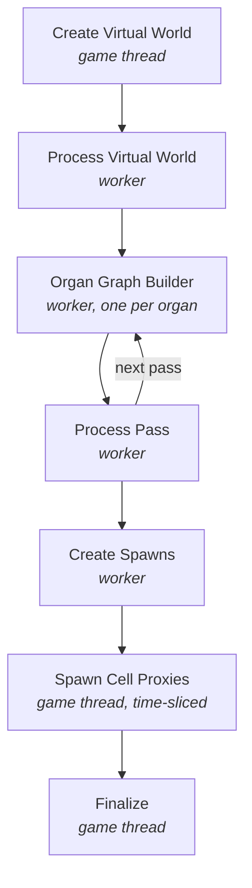

# Tasks

The work an [Assembly Operation](../types/assembly-operation.md) actually performs, split into task-graph jobs. Each is an internal native struct or class under `Assembly/Tasks/`; none is Blueprint-exposed.

The single most important property of this set is **which thread each job runs on**, because that is what decides how much of a generation run can happen off the game thread.

## The Jobs

| Task | Thread | Purpose |
| :-- | :-- | :-- |
| `FNCreateVirtualWorldTask` | **Game thread** | Snapshots the target world into a virtual world context. |
| `FNProcessVirtualWorldTask` | Any worker | Transforms that snapshot into the form the collision checks expect. |
| `FNOrganGraphBuilderTask` | Background worker | Builds the assembly graph for one organ. |
| `FNProcessPassTask` | Any worker | Promotes a pass's graphs to the top-level context and publishes their hulls. |
| `FNCreateSpawnsTask` | Any worker | Flattens per-organ graphs into a single cell-node spawn list. |
| `FNSpawnCellProxiesTask` | **Game thread** | Spawns [Cell Proxy](../types/cell-proxy.md) actors, time-sliced. |
| `FNAssemblyFinalizeTask` | **Game thread** | Notifies the operation the graph has drained. |

Only three are pinned to the game thread, and each for a concrete engine reason rather than convenience.

## Why The Game-Thread Jobs Are Pinned

**`FNCreateVirtualWorldTask`** walks live `AActor`s to gather their simple-collision meshes and transforms. Those queries are not safe from a worker thread, so the snapshot must be taken on the game thread — which is precisely why it is a *snapshot*. Everything downstream reads the copy.

It also filters as it gathers: organ volumes are excluded, because they are *inputs* to generation rather than collision to avoid, as are actors with no collision.

**`FNSpawnCellProxiesTask`** spawns actors, which the engine only permits on the game thread. It drains a **time-sliced batch** per invocation rather than all pending nodes, and signals its completion event once the spawn context's cursor reaches the end of the list. That is what keeps a large generation from stalling a frame.

**`FNAssemblyFinalizeTask`** fires the operation's completion delegates and unlinks the task-graph context. Delegates may reach into gameplay or UI, so it runs where that is safe.

## The Off-Thread Work

`FNOrganGraphBuilderTask` is where generation actually happens. It builds one organ's graph using the **Frontier model** — expanding outward from each bone, consuming open junctions, until none remain or the organ's bounds or cell limits are hit. One task per organ, so independent organs build in parallel.

`FNProcessPassTask` runs between passes: it moves the graphs a pass produced up to the top-level context and adds their cell hulls to the world context, so the *next* pass treats already-placed cells as collision. That is what makes phased organs compose rather than overlap.

:::warning[Concurrency contract]

`FNCreateSpawnsTask` runs on any worker, and **multiple operations may run their own instance concurrently**. Anything shared it touches must be thread-safe. If you extend this stage, assume another operation is executing the same code beside you — the per-operation state it writes is safe precisely because it is per-operation.

:::

## Ordering

The dependency chain is linear at the level of stages even though organ builds fan out within one:

See [Process Flows](../process-flows.md) for the same sequence described from a user's perspective, and [Analytics](analytics.md) for the timing each stage records.
