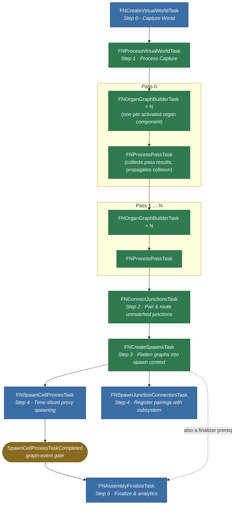

# Tasks

The work an [Assembly Operation](../types/assembly-operation.md) actually performs, split into task-graph jobs. Each is an internal native struct or class under `Assembly/Tasks/`; none is Blueprint-exposed.

The single most important property of this set is **which thread each job runs on**, because that is what decides how much of a generation run can happen off the game thread.

## The Jobs

| Task | Thread | Purpose |
| :-- | :-- | :-- |
| `FNCreateVirtualWorldTask` | **Game thread** | Snapshots the target world into a virtual world context. |
| `FNProcessVirtualWorldTask` | Any worker | Transforms that snapshot into the form the collision checks expect. |
| `FNOrganGraphBuilderTask` | Background worker | Builds the assembly graph for one organ. |
| `FNProcessPassTask` | Any worker | Promotes a pass's graphs to the top-level context and publishes their hulls. |
| `FNConnectJunctionsTask` | Any worker | Pairs unmatched junctions and routes a collision-free path between each pair. |
| `FNCreateSpawnsTask` | Any worker | Flattens per-organ graphs into a single cell-node spawn list. |
| `FNSpawnCellProxiesTask` | **Game thread** | Spawns [Cell Proxy](../types/cell-proxy.md) actors, time-sliced. |
| `FNSpawnJunctionConnectorsTask` | **Game thread** | Hands accepted junction pairings to the [subsystem](../types/world-assembly-subsystem.md#junction-connectors). |
| `FNAssemblyFinalizeTask` | **Game thread** | Notifies the operation the graph has drained. |

Only four are pinned to the game thread, and each for a concrete engine reason rather than convenience.

## Why The Game-Thread Jobs Are Pinned

**`FNCreateVirtualWorldTask`** walks live `AActor`s to gather their simple-collision meshes and transforms. Those queries are not safe from a worker thread, so the snapshot must be taken on the game thread — which is precisely why it is a *snapshot*. Everything downstream reads the copy.

It also filters as it gathers: organ volumes are excluded, because they are *inputs* to generation rather than collision to avoid, as are actors with no collision.

**`FNSpawnCellProxiesTask`** spawns actors, which the engine only permits on the game thread. It drains a **time-sliced batch** per invocation rather than all pending nodes, and signals its completion event once the spawn context's cursor reaches the end of the list. That is what keeps a large generation from stalling a frame.

**`FNSpawnJunctionConnectorsTask`** touches the [World Assembly Subsystem](../types/world-assembly-subsystem.md#junction-connectors) and the asset manager. It is cheap enough not to warrant a slice of its own, so it rides alongside `FNSpawnCellProxiesTask`.

**`FNAssemblyFinalizeTask`** fires the operation's completion delegates and unlinks the task-graph context. Delegates may reach into gameplay or UI, so it runs where that is safe.

## The Off-Thread Work

`FNOrganGraphBuilderTask` is where generation actually happens. It builds one organ's graph using the **Frontier model** — expanding outward from each bone, consuming open junctions, until none remain or the organ's bounds or cell limits are hit. One task per organ, so independent organs build in parallel.

A builder is only created for components whose `SourceComponent->bActivated` is true — an inactive organ is skipped entirely rather than built and discarded. A pass containing nothing but inactive components still increments the pass counter but adds no tasks to the graph.

`FNProcessPassTask` runs between passes: it moves the graphs a pass produced up to the top-level context and adds their cell hulls to the world context, so the *next* pass treats already-placed cells as collision. That is what makes phased organs compose rather than overlap.

:::warning[Concurrency contract]

`FNCreateSpawnsTask` runs on any worker, and **multiple operations may run their own instance concurrently**. Anything shared it touches must be thread-safe. If you extend this stage, assume another operation is executing the same code beside you — the per-operation state it writes is safe precisely because it is per-operation.

:::

## Junction Connecting

The graph builders only ever grow a **new** cell off an open junction. Anything left unmatched when they finish is capped with a [filler](../types/cell-junction-filler.md) — even when another cell's opening is sitting a few metres away facing straight at it.

`FNConnectJunctionsTask` is what closes that gap. It runs **once**, after every pass has collected its graphs and *before* `FNCreateSpawnsTask` generates link details — which is precisely what lets an accepted pairing simply **link the two junctions** and have the existing link-detail generation carry the result to runtime.

### What It Does

1. **Gathers** every unmatched junction across every graph, in a stable order, counting those carrying [`Disable Connecting`](../types/junction-component.md#disable-connecting).
2. **Mates coincidences** — pairs already sitting in the same opening facing opposite ways, if [`Connect Coincidences`](../project-settings.md#coincident-mating) is on. These link as a plain cell mating: nothing is routed and nothing is spawned.
3. **Builds candidate pairs** from what remains, gated on socket size, distinct cells, the opt-out flag, range, and [orientation](../project-settings.md#orientation-gating) — emitted nearest-first.
4. **Routes** each candidate via [`FNJunctionConnectorSolver`](../types/junction-connector-solver.md), retrying against straighter tangents when a route turns too tightly and against a bounded set of detours when it collides.
5. **Accepts greedily**, retaining every accepted route's swept hulls as collision so later pairs route around it.

Coincidence mating runs **before** the routing walk for two reasons: the links it creates must be visible to the [Allow Multiple Cell Connections](../project-settings.md#one-connection-per-cell-pair) check, and a coincident pair must never reach the solver, which would reject it as `Degenerate`.

:::info[Why the Orientation Gate Lives Here, Not in the Solver]

The solver's shape limits reject a pairing only when the sockets sit close enough together to force a tight turn. Given enough distance, the *same* badly-oriented pairing curves gently enough to clear every shape limit.

The orientation gate rejects on the orientations alone, however much room the route is given — and it runs **before any routing**, so the pass gets cheaper rather than more expensive.

:::

### Determinism

**Nothing in this stage consults a random stream.** Candidate ordering, corner correspondence, and detour ordering are all derived from the geometry, so the same layout always connects up the same way.

The pass runs on any worker thread. It reads the graphs and the virtual world snapshot — both complete and no longer being mutated by the time its prerequisites have finished — and is the only writer of the connector collision arrays and the connection list.

### Collision Testing

Two sweeps, coarse then exact, tested against world geometry, placed cells, and connectors already accepted.

A socket sits **on** its cell's hull surface, so a probe there always intersects the cell that owns it. Rather than exempting the two endpoint cells outright — which would let a route tunnel back through its own cell unnoticed — the exemption is limited to the hulls within [`Endpoint Exclusion`](../project-settings.md#endpoint-exclusion) of each socket.

### Spawning Is a Separate Stage

`FNSpawnJunctionConnectorsTask` deliberately **spawns nothing**. A connector spans two cells, and cells stream in asynchronously — at the point it runs, neither endpoint's `UNCellJunctionComponent` exists, so there is nothing to connect and no way to resolve the junction-level overrides that live on those components.

It hands each pairing to the [World Assembly Subsystem](../types/world-assembly-subsystem.md#junction-connectors) and warms the project-wide default connector class so it is resident when the pairings are built. The junctions then report in as they begin play, and the subsystem builds each pairing once both ends have arrived.

## Ordering

The dependency chain is linear at the level of stages, even though organ builds fan out within one and passes repeat:

Node colour follows the thread column above — game thread and any worker.

Three details the shape alone does not show:

- **Hot paths are resolved before any link details are generated.** `FNCreateSpawnsTask` now resolves *every* graph's hot path before generating link details for any of them, rather than interleaving the two per graph. A connector link can reach a cell in **another graph**, and the previous ordering baked in that neighbour's hot-path flags before they had been computed.
- **Passes chain on the collector, not the builders.** Each pass's organ builders depend on the *previous* pass's `FNProcessPassTask` rather than on its builders, so that pass's collision data is fully propagated into the shared `FNVirtualWorldContext` before any builder reads `NodeCollisionMeshes`.
- **A graph event gates finalize, not the spawn task.** `SpawnCellProxiesTaskCompleted` is a manually-fired `FGraphEvent` that `FNSpawnCellProxiesTask` triggers once its time-sliced work drains. That event is what releases `FNAssemblyFinalizeTask` — the dispatcher task completing is not sufficient on its own. `FNCreateSpawnsTask` is separately a finalizer prerequisite.

See [Analytics](analytics.md) for the timing each stage records.
