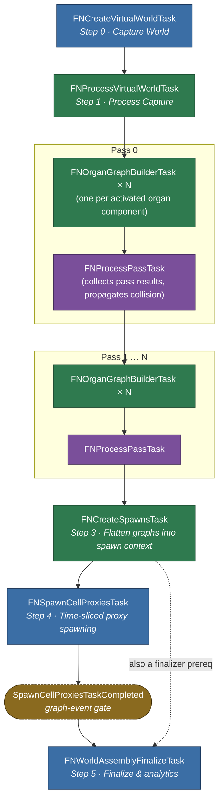

## Task Graph

`FNWorldAssemblyTaskGraph` builds — but does not dispatch — the following dependency chain. `UnlockTasks()` then releases every node in construction order.

### Notes

- **Per-pass chaining.** Each pass's organ builders chain on the *previous* pass's `FNProcessPassTask` (not its organ builders) so that pass's collision data is fully propagated into the shared `FNVirtualWorldContext` before any builder reads `NodeCollisionMeshes`.
- **Inactive components are skipped.** `FNOrganGraphBuilderTask` is only created for components whose `SourceComponent->bActivated` is true. A pass with zero activated components still increments the pass counter but adds no tasks.
- **Thread targets.**
  - Game Thread: world capture, proxy spawning, finalize.
  - Any Normal Thread: world processing, organ graph building, spawn-context creation.
  - Any Background Thread: per-pass collection (`FNProcessPassTask`).
- **`SpawnCellProxiesTaskCompleted`** is a manually-fired `FGraphEvent` the spawn task triggers when its time-sliced work finishes; it is what actually gates `FNWorldAssemblyFinalizeTask`, not the dispatcher task itself.