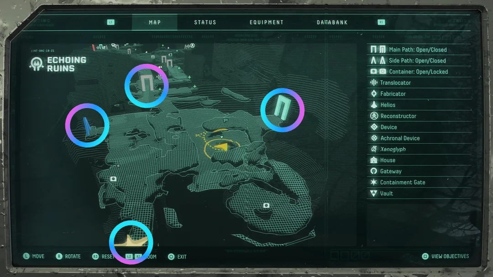
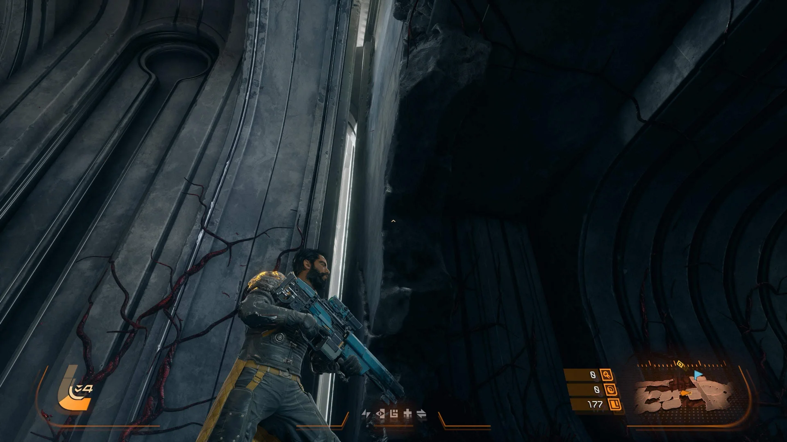

# Junction

A Junction serves as a sized (XY) connection point between two [Cells](cell.md). During the assembly process, Junctions are used to determine if a Cell can be attached based on its own collision data, `Socket Size`  and additional constraints.

In games like [Returnal](https://housemarque.com/games/returnal), when looking at the area map, you can clearly see where its junctions are, and if they have been filled or connected to other areas.

## Creating Junctions

A Junction is represented in the world by adding a `UNCellJunctionComponent` to an object in the world, this can be done while in `World Assembly Mode` for a NCell, and selecting the Junction dropdown's **Add Component**.

## Editing Junctions

### Settings

| Setting | Type | Description | Default |
|---|---|---|---|
| Type | `ENCellJunctionType` | **NOT IMPLEMENTED** | `Two-Way` |
| Requirements | `ENCellJunctionRequirements` | **NOT IMPLEMENTED** | `AllowBlocking` | 
| Socket Size | `FIntVector2` | Size of the junction socket in grid units (width, height) | `(2,4)` | 
| Rotation Contraints | `FNRotationConstraints`| What rotations can be made by this junction to match another. | |
| Weighting | `int32` | Relative weight against other junctions in the cell for selection. | `1` | 

### Gizmo

The in-editor drawing of the Junction is meant to convey specific information about the settings of the Junction.

#### Sizing

The circurual nubs are representative of size and scale of the defined `Socket Size`. 

#### Directionality

The arrow in the middle indicates the forward direction of the Junction, this is important because you always want the direction facing into the room.

#### Color

The color of the gizmo conveys if any of the points are considered inside (pink) or all outside of the [Cell](cell.md)'s convex hull. One of the standout features of the placement system in `NWorldAssembly` is that it allows for penetrating matching of junctions (up to a defined distance). This coloring is just meant to indicate that those pink junctions will be effected by those settings.

#### Corner Points

These lines indicate if the Junction has had its `Type` set to `Two-Way`, `In-Only`, `Out-Only` or `One-Way`

## What's Better

There is nothing novel about the idea of stitching a map together from discrete peices, where `NWorldAssembly` shines is its ability to over come some of the hurdles of doing so still present in games today. By planning for penetration testing from the start it can avoid gaps commonly associated with stitching.

