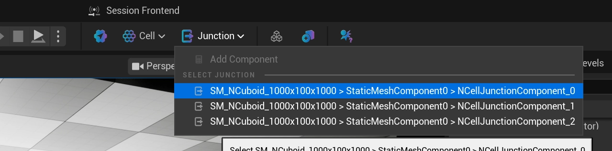
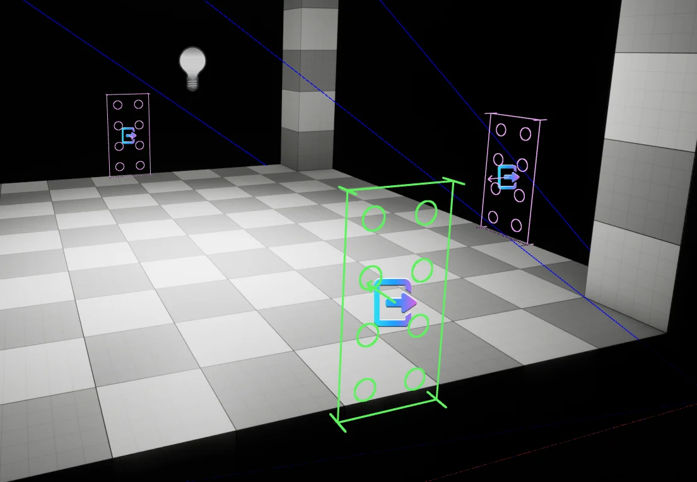

# Junction

:::info[Wikipedia Definition]

Cell junctions are a class of cellular structures consisting of multiprotein complexes that provide contact or adhesion between neighboring cells or between a cell and the extracellular matrix in animals.

:::

A Junction serves as a sized (XY) connection point between two [Cells](../cell/index.md). During the assembly process, Junctions are used to determine if a Cell can be attached based on its own collision data, `Socket Size` and additional constraints.

In [Returnal](https://housemarque.com/games/returnal), when looking at the area map, you can clearly see where its junctions are, and if they have been filled or connected to other areas.

## Creating Junctions

A Junction is represented in the world by adding a `UNCellJunctionComponent` to an object in the world. This can be done while in `World Assembly Mode` for a NCell, and selecting the Junction dropdown's **Add Component**.

A Junction will only persist on a Cell if the level contains a `UNCellRootComponent`. If you add one to a level without a root, the component will log an error and remove itself on the next tick. Each surviving Junction is automatically registered against the owning `ANCellActor` and assigned a stable `InstanceIdentifier`, which is what the side-car data used during generation keys off of.

## Editing Junctions

### Settings

| Setting | Type | Description | Default |
|---|---|---|---|
| Type | `ENCellJunctionType` | **NOT IMPLEMENTED** | `Two-Way` |
| Requirements | `ENCellJunctionRequirements` | **NOT IMPLEMENTED** | `AllowBlocking` | 
| Socket Size | `FIntVector2` | Size of the junction socket in grid units (width, height) | `(2,4)` | 
| Rotation Contraints | `FNRotationConstraints`| What rotations can be made by this junction to match another. | |
| Weighting | `int32` | Relative weight against other junctions in the cell for selection. | `1` | 

### Gizmo

The in-editor drawing of the Junction is meant to convey specific information about the settings of the Junction.

#### Sizing

The circular nubs are representative of the size and scale of the defined `Socket Size`.

#### Directionality

The arrow in the middle indicates the forward direction of the Junction. This is important because you always want the direction facing into the room.

#### Color

The gizmo color is derived from two pieces of state: whether any of the junction's corner points fall inside the Cell's convex hull, and the junction's `Requirements` value.

| Color | Meaning |
|---|---|
| Pink | One or more corner points lie inside the Cell's convex hull. Overrides the `Requirements` colors. |
| Light Green | `Required` |
| Mid Green | `Allow Blocking` |
| Dark Green | `Allow Empty` |

The pink override exists because `NWorldAssembly`'s placement system permits penetrating matches (up to a configured distance). A pink junction signals that it sits inside the hull and will be subject to those penetration settings — not that it is misplaced.

:::warning 

This is going to change in the future when the filling/blocking of Junctions is 

:::

#### Corner Points

The corner-point lines indicate the junction's `Type` — `Two-Way`, `In-Only`, `Out-Only`, or `One-Way`.

## Penetration Matching

There is nothing novel about the idea of stitching a map together from discrete pieces — where `NWorldAssembly` shines is in its ability to overcome hurdles that still show up in games today. By planning for penetration testing from the start it can avoid the gaps commonly associated with stitching. An example of the gaps can be seen in this image from the recent, [SAROS](https://housemarque.com/games/saros).

