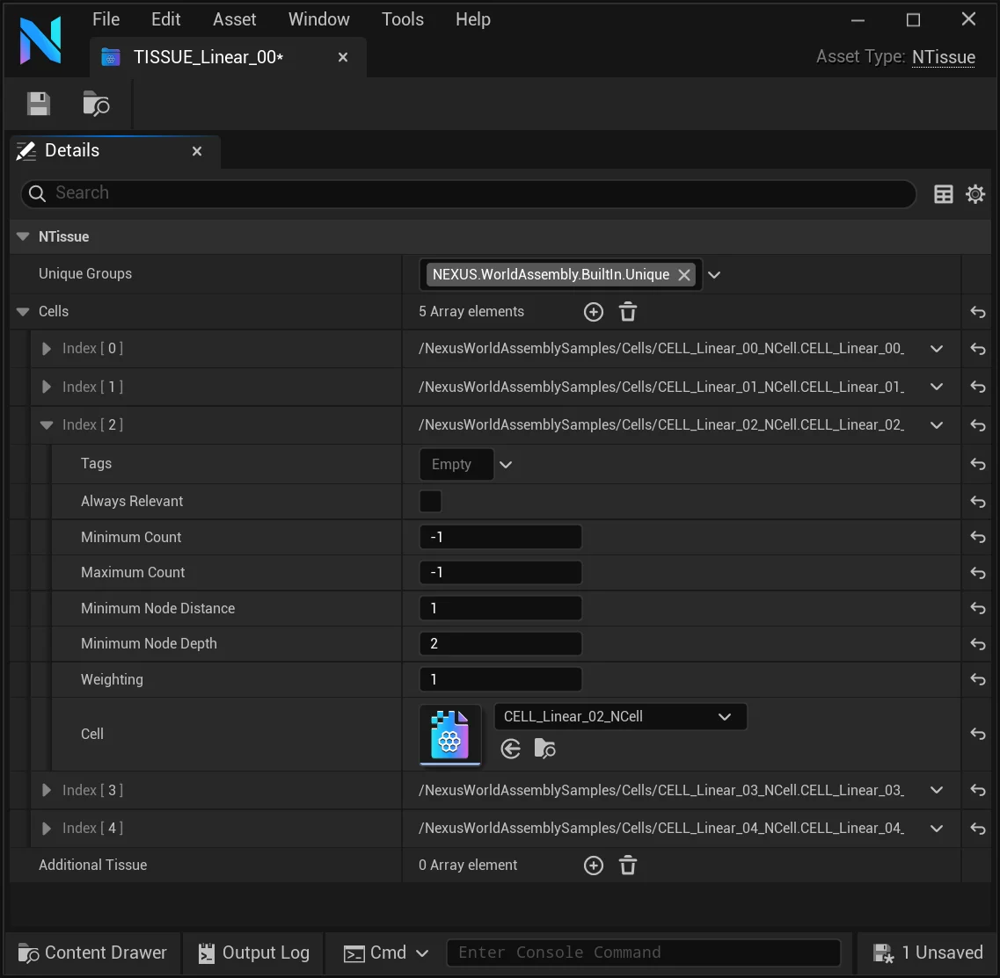

# Tissue

A tissue defines the Cells which can be used in that specific tissue. If multiple Tissues are assigned to an Organ a combinatory effect will apply where all tissue entries will be flattened down into a single list, similarly to how sub-tissues work.