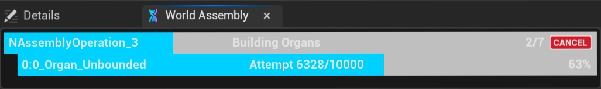

import TypeDetails from '../../../src/components/TypeDetails';

# Developer Overlay

<TypeDetails icon="/assets/svg/world-assembly/world-assembly.svg" iconType="img" base="UNDeveloperOverlay" type="UNWorldAssemblyDeveloperOverlay" typeExtra="" headerFile="NexusWorldAssembly/Public/NWorldAssemblyDeveloperOverlay.h" />

By going to `Tools > NEXUS > World Assembly`, you can create a [UNEditorUtilityWidget](/docs/plugins/ui/editor-types/editor-utility-widget/) wrapped version of `/NexusWorldAssembly/WB_NWorldAssemblyDeveloperOverlay` which will show the status of AssemblyOperations in flight. 

:::tip

This overlay (`WB_NWorldAssemblyDeveloperOverlay`) can be included in packaged builds and will function just like a `UUserWidget`-based widget.

:::

## Understanding The Bars

### Top-Level Bars

Each `Assembly Operation` is given a top-level bar whilst it is running. On the left is the generated (or manually given) name of the `Assembly Operation`. 

In the middle is the last `Status Message` broadcast out from any of the tasks, running underneath the operation. This messaging system operates on a thread-safe consumption model so it is used sparingly and mainly to convey top-level status.

On right, is a status of the known tasks completion (the progress bar reflects that ratio).

The **CANCEL** button allows for the cancellation of in-flight operations. It will provide signal to the numerous tasks not to continue / or output content. It is not an immediate tear down; it does its best to make it quick.

### Secondary Channel Bars

Some tasks open additional messaging channels to report back progress.

| Task | Description |
| :-- | :-- |
| `FNOrganGraphBuilderTask` | Each task will create its own channel to provide feedback on its progress to place cells in the defined space. The left-most text indicates the `<Phase>:<Index>_<OrganName>` that is being operated on, with the number of attempts to satistisfy the requirements of that organ being used as the progress. |