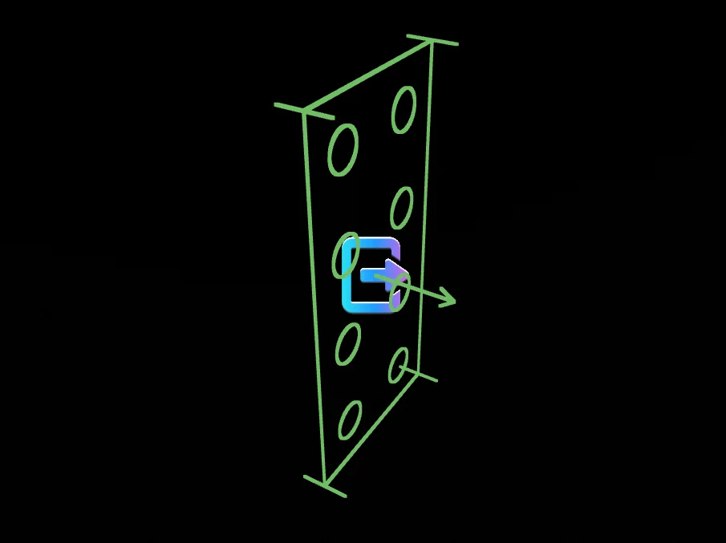
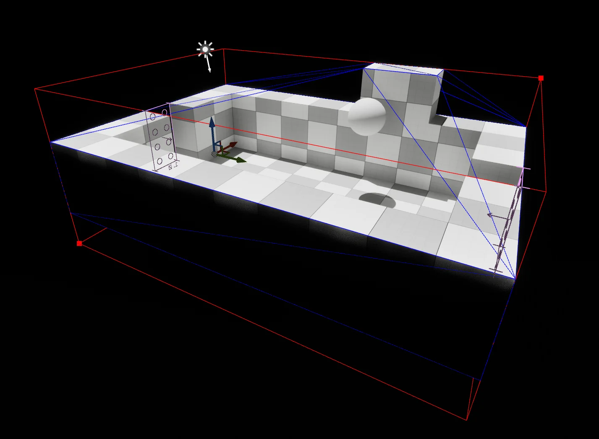
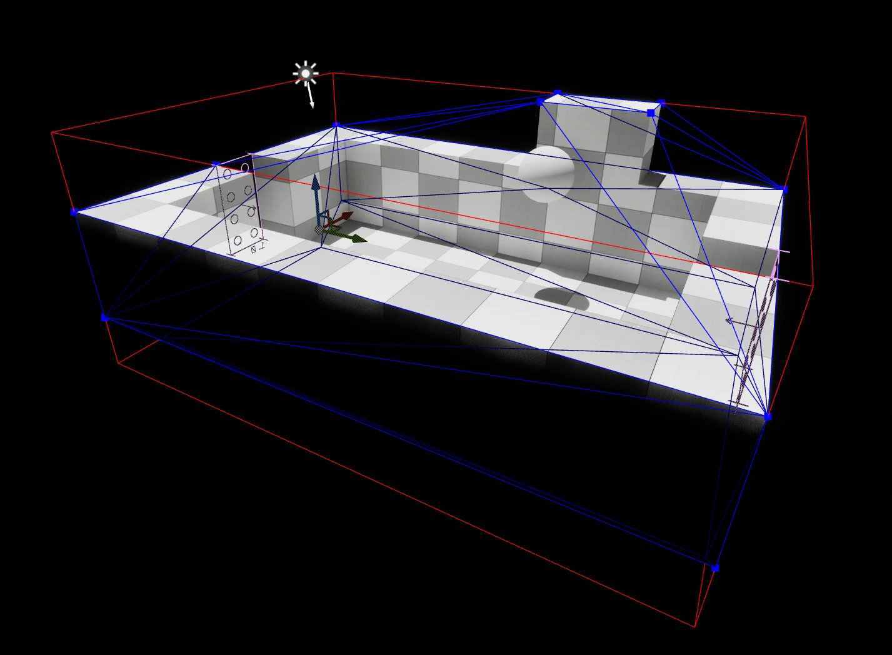
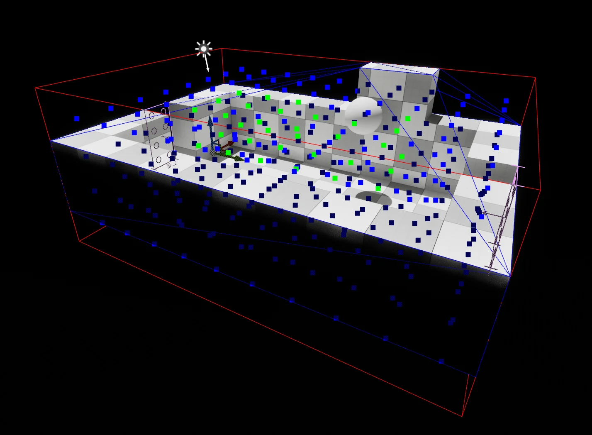

# Cell Editor

The editor of all things [Cell](../types/cell.md)-related when it comes to a level.

- The red wireframe cube is the cell bounds.
- The blue wireframe is the collision/convex mesh.
- The lego-like rectangles represent the junctions of the cell, where it can connect to other [Cell](../types/cell.md)(s) and [Bone](../types/bone-component.md)(s).

## Toolbar

### No ANCellActor Present

When no `ANCellActor` is present in a given level, despite being in World Assembly Mode, a simplified toolbar is present with a button to add a `ANCellActor` to the current level.

Once an `ANCellActor` is present in the level, the toolbar will expand out with supported features.

### Cell Selection Button

|Button|Action|Description|
|---|---|---|
| | Select `ANCellActor` | Selects the levels `ANCellActor`, converting into an edit selection mode. |
| | [Edit Bounds](#editing-bounds) | Default behavior when an `ANCellActor` is selected, allowing the editing of the defined AABB. If altered, will flag data to not be automatically calculated.
| | [Edit Convex Hull](#editing-convex-hull)* | Switches to editing the convex hull generated from the level. _Options are available to break the convex requirement._
| | [Edit Voxel Data](#editing-voxel-data)| Switches to editing the voxel data created from the level.

### Cell Menu

Using the Cell menu, you can operate on the levels `ANCellActor` which inturn, propagates it's data to the `UNCell` associated to the level. It is this connection that allows for an Assembly Operation to have an understanding of a level, without having to have it loaded.

#### Asset

| Command | Description |
| --- | --- |
| Capture Thumbnail | Captures the current viewport (minus gizmos) as the thumbnail for the current level, also applies a version to the associated `UNCell` without gizmos. |

#### Calculate

| Command | Description |
| --- | --- |
| Calculate All | Calculates all calculatable data for the `ANCellActor`'s `UNCellRootComponent`. |
| Calculate Bounds | Calculate the **bounds** for the `ANCellActor`'s `UNCellRootComponent` which gets propagated to the associated `UNCell`; overwriting any previous edits. |
| Calculate Hull | Calculate a **convex hull** for the `ANCellActor`'s `UNCellRootComponent` which gets propagated to the associated `UNCell`; overwriting any previous edits. |
| Calculate Voxel Data | Calculate the **voxel data** for the `ANCellActor`'s `UNCellRootComponent` which gets propagated to the associated `UNCell`; overwriting any previous edits. |

#### Quick Settings

| Command | Description |
| --- | --- |
| Calculate Bounds On Save | Toggles `FNCellBoundsGenerationSettings::bCalculateOnSave` on the `ANCellActor`'s `UNCellRootComponent::Details`. |
| Allow Non-Convex Hull | While editing the convex hull, this option prevents moving edges and vertices into non-convex positions. By enabling this option, non-convex meshes are allowed to be created. This adds a performance cost when evaluating penetration against this mesh as it becomes a complex calculation. By default this remains `false`, use sparingly. |
| Calculate Hull On Save | Toggles `FNCellHullGenerationSettings::bCalculateOnSave` on the `ANCellActor`'s `UNCellRootComponent::Details`. |
| Calculate Voxel Data On Save | Toggles `FNCellVoxelGenerationSettings::bCalculateOnSave` on the `ANCellActor`'s `UNCellRootComponent::Details`. |
| Use Voxel Data w/ Cell | Enables using voxel data with a [Cell](../types/cell.md), `false` by default. |

#### Cleanup

| Command | Description |
| --- | --- |
| Reset Cell | Resets the `ANCellActor` in the level, recreating all data back to a default state. |
| Save Cell | Writes out any changed data to the associated `UNCell`. |
| Remove Actor | Removes the `ANCellActor` from the level, and delete the associated sidecar asset (`UNCell`). |

### Junction Menu

Given the importance of deploying junctions in a [Cell](../types/cell.md), the junction menu quickly allows you to add a `UNCellJunctionComponent` to the currently selected `AActor`. As well as a quick selection of any of the already created [Junction](../types/junction-component.md).

## Editing Data

### Editing Junctions

As junctions represent the connection point between other [Cells](../types/cell.md) they are positioned freely and without rotational constraints. They are NOT on a grid by default, however some may choose to place them according to a grid to ensure easier auto-matching of overlapping junctions.

Their matching size is represented by the lego-like nubs visually represented inside of the rectangle. The rendered arrow should always face inward to the cell as [Junctions](../types/junction-component.md) do have directionality.

:::info

More details are available on the [`UNCellJunctionComponent`](../types/junction-component.md).

:::

### Editing Bounds

By clicking either of the bounds points, a translation widget will appear allowing you to grow or shrink the bounds accordingly.

:::warning

When you edit the bounds manaully it will flag the bounds not to be automatically calculated in the future during the saving process. You can revert this through the **Cell Menu** or by manually finding the setting on the `ANCellActor > UNCellRootComponent > Details`.

:::

### Editing Convex Hull

By clicking the vertices, a translation widget will appear allowing you to move them around. In its default state, it will not allow you to break the convexity of the hull (this can be toggled off via the **Cell Menu**).

You can also select edges of the mesh, this is to allow you to split the edge to create new mid-point vertices. When you have an edge selected, the split button will appear in the toolbar.

:::warning

When you edit the convex hull manaully it will flag the hull not to be automatically calculated in the future during the saving process. You can revert this through the **Cell Menu** or by manually finding the setting on the `ANCellActor > UNCellRootComponent > Details`.

:::

## Editing Voxel Data

:::info

While voxel data is made available to edit, it is currently not used in the World Assembly process.

:::

Clicking individual boxes will cycle through their occupancy status.

:::warning

When you edit the voxel data manaully it will flag the voxel data not to be automatically calculated in the future during the saving process. You can revert this through the **Cell Menu** or by manually finding the setting on the `ANCellActor > UNCellRootComponent > Details`.

:::
