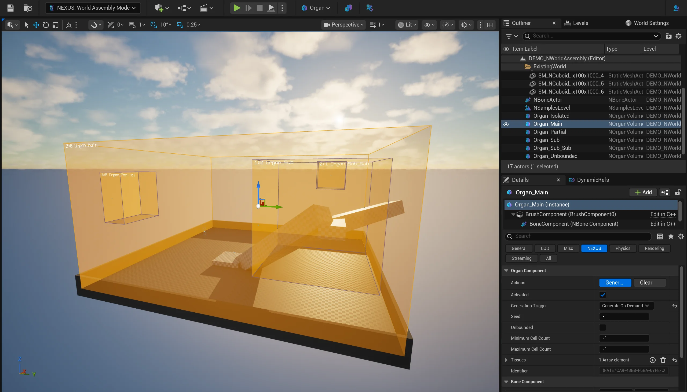
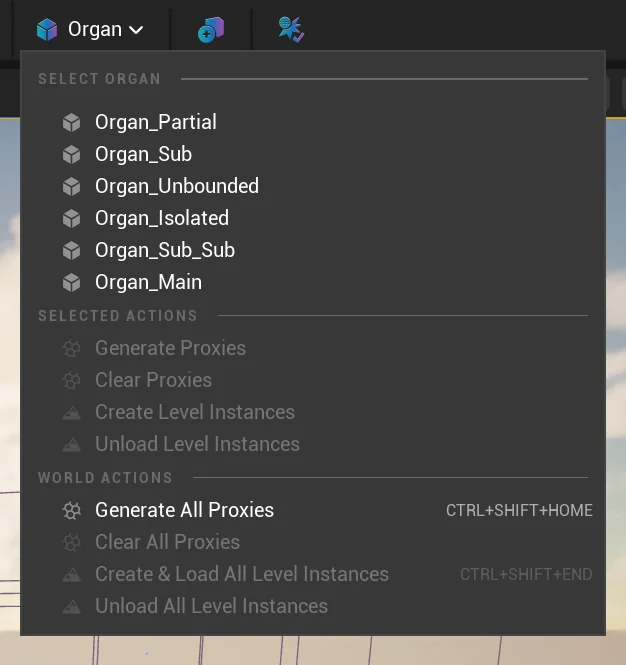
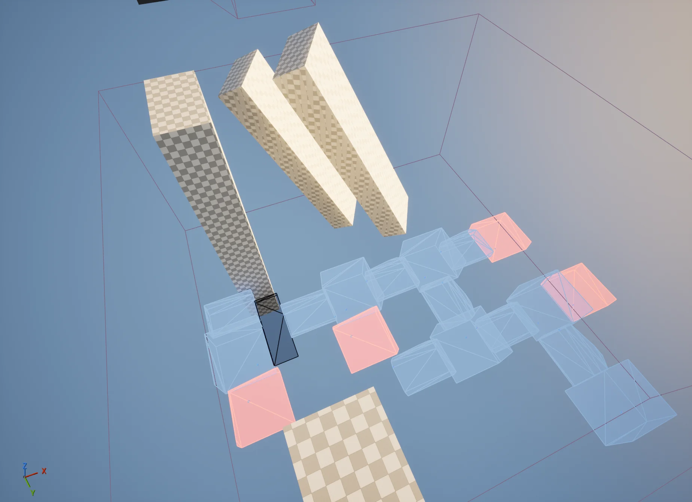
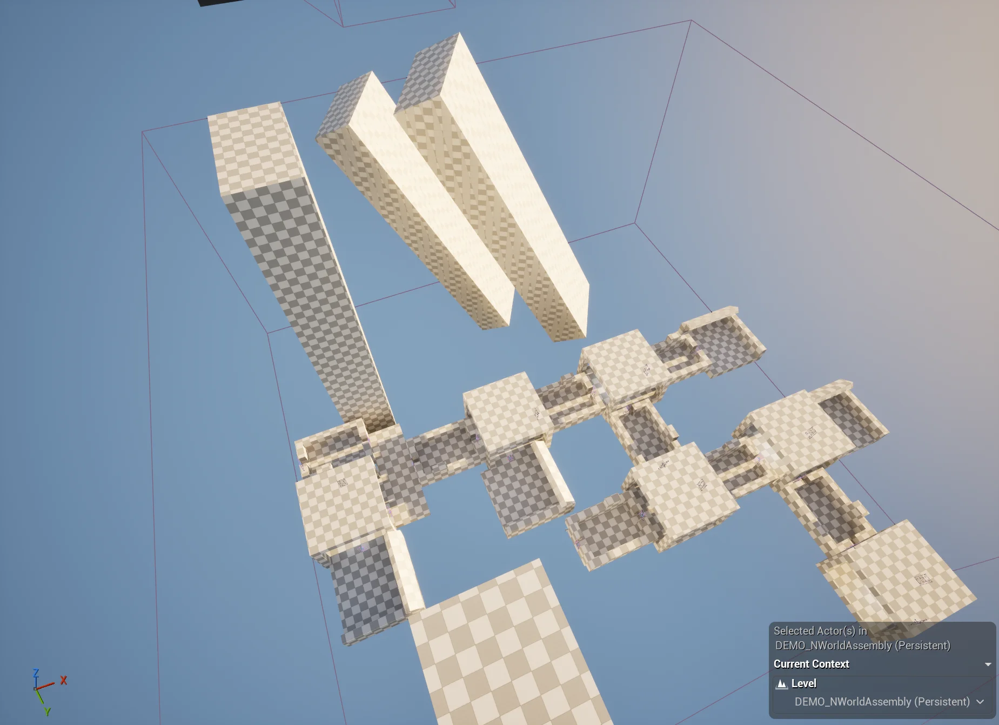

---
tags: [0.3.0]
description: Toolbar options visible when Organs are present in a UWorld.
—--

# Organ Editor

## Phase Detection

When a [Organ](../types/organ-volume.md) is selected, a quick process runs to determine its assembly order of operation, determining parallel actions and phases. The labels above each volume indicate the `<Phase>:<Index>_<Name>`.

The ordering is determined by first deterministically sorting the [Organs](../types/organ-volume.md) by their internal `FGuid`. Then detecting which volumes fully encompass and intersect one another, and finally appending independent phases/passes for `Unbounded volumes (as they could have world-wide impact). 

## Toolbar

The toolbar is kept to a minimum when outside of cell-editing, showing an Organ dropdown menu as well as a button to spawn a transient-visualizer of what the current `UWorld`s collision will be. You have to move the visualizer to see it as it will spawn in place.

### Organ Menu

#### Select Organ

A list of known [Organ](../types/organ-volume.md) in the world are listed to allow for quick-selection.

#### Selected Actions

Once an [Organ](../types/organ-volume.md) is selected, specific functionality is made available just targeting the selected [Organ](..types/organ-volume.md). 

#### World Actions

##### Generate All Proxies

Runs an editor-time assembly operation for all [Organ](/types/organ-volume.md) in the `UWorld`. Placing transient `ANCellProxy` into the `UWorld` representing the generated cell graph. 
 

Added elements are tracked so that repeated generation will remove the last. This is useful to quickly see how WorldAssembly is going to behave through rapid iterations.

##### Clear All Proxies

Clears all of the previous editor-time assembly operation’s `ANCellProxy`.  This also will clear any `ANCellLevelInstance` that were produced by any create or load operation as well.

##### Create & Load All Level Instances

Creates and loads all levels instances derived from the `ANCellProxy`. Spawning associated `ANCellLevelInstances` and applying the `INCellInitialized` interface-based callback.

##### Unload All Level Instances

Unloads all of the created `ANCellLevelInstances`, leaving their base `AActor` in place.

## Hotkeys

|Chord|Description|
|——-|——-|
| `CTRL+SHIFT+HOME` | Generate All Proxies |
| `CTRL+SHIFT+END` | Create & Load All Level Instances |