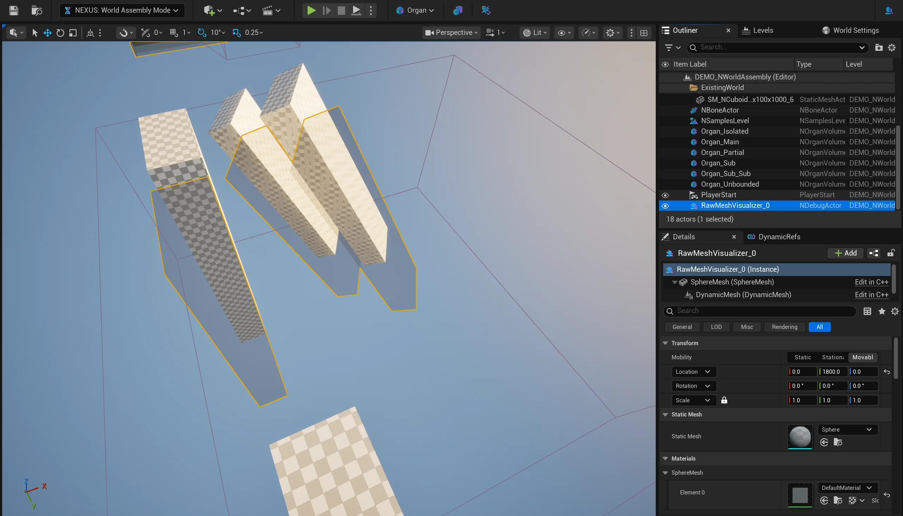

# Organ Editor

## Phase Detection

When a [Organ](../types/organ-volume.md) is selected, a quick process runs to determine its assembly order of operation, determining parallel actions and phases. The labels above each volume indicate the `<Phase>:<Index>_<Name>`.

The ordering is determined by first deterministically sorting the [Organs](../types/organ-volume.md) by their internal `FGuid`. Then detecting which volumes fully encompass and intersect one another, and finally appending independent phases/passes for `Unbounded volumes (as they could have world-wide impact). 

## Toolbar

The toolbar is kept to a minimum when outside of cell-editing, showing an Organ dropdown menu, the optional Quick Assembly section, and a [World Collision Visualizer](#world-collision-visualizer) toggle.

### Quick Assembly

An optional section of the toolbar when in **World Assembly Editor Mode** with [Organs](../types/organ-volume.md) present in the `UWorld`, that allows you to select an [Organ](../types/organ-volume.md) and create an assembly operation for it. The resulting operation will load the placed [Cells](../types/cell.md) all the way through `ANCellProxy` to the actualized `ANCellLevelInstance`.

During the operation, the button's action changes to cancellation of the started operation, and its progress bar tracks the run.

The dropdown (`▾`) beside the start/cancel button exposes quick toggles that mirror the [User Settings → Quick Assembly](../user-settings.md#quick-assembly):

- **Load Level Instances** — carry each run through to actualized `ANCellLevelInstance`s rather than stopping at `ANCellProxy`.
- **Auto Assembly** — after each run finishes, re-trigger the operation on a timer (the **Auto Assembly Timer**, 2–180s) and loop until cancelled. While looping, the button stays in its cancel state and its progress bar shows the countdown between runs. When you stop the loop a single summary toast reports the accumulated pass / warning / fail counts, total cells created, and total time — provided **Toast Editor Assembly Operations** is enabled in the [User Settings](../user-settings.md#notifications).

:::info

**Fillers** are not placed outside of `PIE` or runtime, optionally the unfilled junctions can have their gizmos colored differently in this situation.

:::

### World Collision Visualizer

A toolbar toggle (**Toggle Collision Visualizer**) spawns a temporary, transient actor that previews the merged world-collision geometry an assembly run will see — the simple collision of every actor that passes World Assembly's world-actor filter, merged into one mesh. It spawns in place (move it to see it) and tracks world changes, rebuilding as you add, remove, move, or edit geometry.

The captured geometry honours the **World Collisions** options in [Project Settings](../project-settings.md) (actor ignore tags, player starts, and collision-disabled exclusion), and the preview is drawn with the **Collision Visualizer Material** from the [Editor Settings](../editor-settings.md). To exclude a specific actor from the capture, select it and use the **Ignore Actor (World Collision)** toolbar toggle, which applies the [`NWorldCollision_Ignore`](../tagging.md#world-collision-markup-tags) tag.

### Organ Menu

#### Select Organ

A list of known [Organ](../types/organ-volume.md) in the world are listed to allow for quick-selection.

#### Selected Actions

Once an [Organ](../types/organ-volume.md) is selected, specific functionality is made available just targeting the selected [Organ](../types/organ-volume.md). 

#### World Actions

##### Generate All Proxies

Runs an editor-time assembly operation for all [Organ](../types/organ-volume.md) in the `UWorld`. Placing transient `ANCellProxy` into the `UWorld` representing the generated cell graph. 
 

Added elements are tracked so that repeated generation will remove the last. This is useful to quickly see how WorldAssembly is going to behave through rapid iterations.

##### Clear All Proxies

Clears all of the previous editor-time assembly operation’s `ANCellProxy`.  This also will clear any `ANCellLevelInstance` that were produced by any create or load operation as well.

##### Create & Load All Level Instances

Creates and loads all levels instances derived from the `ANCellProxy`. Spawning associated `ANCellLevelInstances` and applying the `INCellInitialized` interface-based callback.

##### Unload All Level Instances

Unloads all of the created `ANCellLevelInstances`, leaving their base `AActor` in place.

## Hotkeys

|Chord|Description|
| --- | --- |
| `CTRL+SHIFT+HOME` | Generate All Proxies |
| `CTRL+SHIFT+END` | Create & Load All Level Instances |