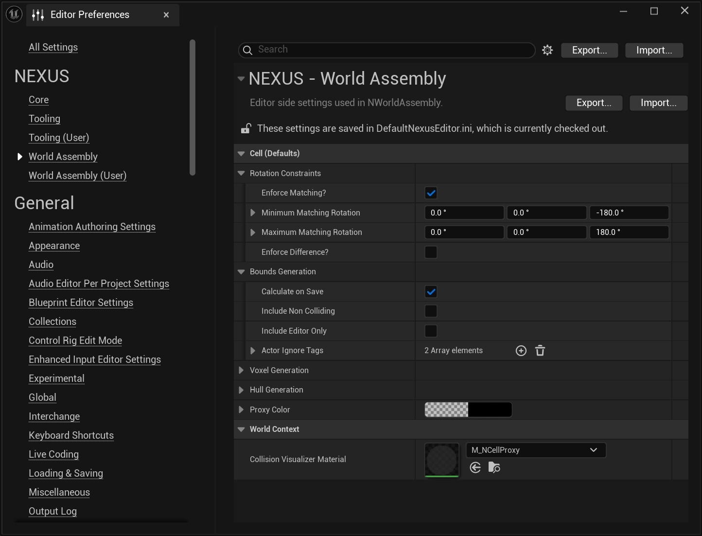

# Editor Settings

Project-shared editor settings for World Assembly. Unlike the per-user [User Settings](user-settings.md), these are saved to the project's editor config (`DefaultNexusEditor.ini`) and are intended to be checked into source control so every contributor starts new cells from the same studio defaults.

From the `Edit > Editor Preferences` window, find the **World Assembly** section (the per-user values live in the separate **World Assembly (User)** section).

## Configuration Options

### Cell (Defaults)

These values seed a newly-created `ANCellActor`'s [`UNCellRootComponent`](types/cell.md#cell-root-component) when it is placed via the [Cell Editor](editor-mode/cell-editor.md). They only affect cells created after they are set — existing cells keep whatever they were authored with. See [Cell](types/cell.md) for the meaning of each individual field within these groups.

| Setting | Type | Description | Default |
| :-- | :-- | :-- | :-- |
| `Rotation Constraints` | `FNRotationConstraints` | Default [rotation constraints](types/cell.md#rotation-constraints) applied to new cell roots. | _struct defaults_ |
| `Bounds Generation` | `FNCellBoundsGenerationSettings` | Default [bounds settings](types/cell.md#bounds-settings) applied to new cell roots. | _struct defaults_ |
| `Voxel Generation` | `FNCellVoxelGenerationSettings` | Default [voxel settings](types/cell.md#voxel-settings) applied to new cell roots. | _struct defaults_ |
| `Hull Generation` | `FNCellHullGenerationSettings` | Default [hull settings](types/cell.md#hull-settings) applied to new cell roots. | _struct defaults_ |
| `Proxy Color` | `FLinearColor` | Default proxy color applied to new cell roots. | Black `(0, 0, 0)` |

### World Context

| Setting | Type | Description | Default |
| :-- | :-- | :-- | :-- |
| `Collision Visualizer Material` | `TSoftObjectPtr<UMaterialInterface>` | Material applied to the debug geometry of the [world-collision visualizer](editor-mode/organ-editor.md#world-collision-visualizer) — the transient actor spawned from the Organ toolbar that previews what the current `UWorld`'s collision will look like to an assembly run. | `M_NCellProxy` |

## See Also

- [Project Settings](project-settings.md) — shared, project-wide runtime configuration saved to project config.
- [User Settings](user-settings.md) — per-user, machine-local editor preferences stored outside project config.
