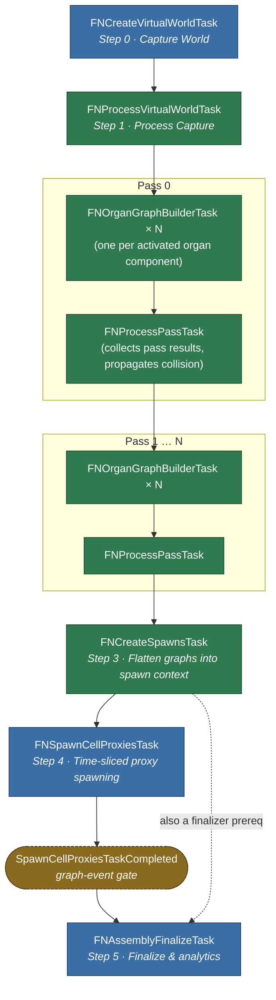

# Process Flows

While not necessary to understand in-depth, these flowcharts express some of the inner workings of the systems used inside of World Assembly in a digestable way. 

## Task Graph

When a `FNAssemblyTaskGraph` is created, it builds out the full graph of tasks but does not dispatch them until instructed.

### Order Of Operations

### Notes

- **Per-pass chaining.** Each pass's organ builders chain on the *previous* pass's `FNProcessPassTask` (not its organ builders) so that pass's collision data is fully propagated into the shared `FNVirtualWorldContext` before any builder reads `NodeCollisionMeshes`.
- **Inactive components are skipped.** `FNOrganGraphBuilderTask` is only created for components whose `SourceComponent->bActivated` is true. A pass with zero activated components still increments the pass counter but adds no tasks.
- **Thread targets** (from each task's `GetDesiredThread()`):
  - Game Thread: world capture (`FNCreateVirtualWorldTask`), proxy spawning (`FNSpawnCellProxiesTask`), finalize (`FNAssemblyFinalizeTask`).
  - Any Thread (`AnyNormalThreadNormalTask`): world-capture processing (`FNProcessVirtualWorldTask`), organ graph building (`FNOrganGraphBuilderTask`), per-pass collection (`FNProcessPassTask`), and spawn-context creation (`FNCreateSpawnsTask`).
- **`SpawnCellProxiesTaskCompleted`** is a manually-fired `FGraphEvent` the spawn task triggers when its time-sliced work finishes; it is what actually gates `FNAssemblyFinalizeTask`, not the dispatcher task itself.