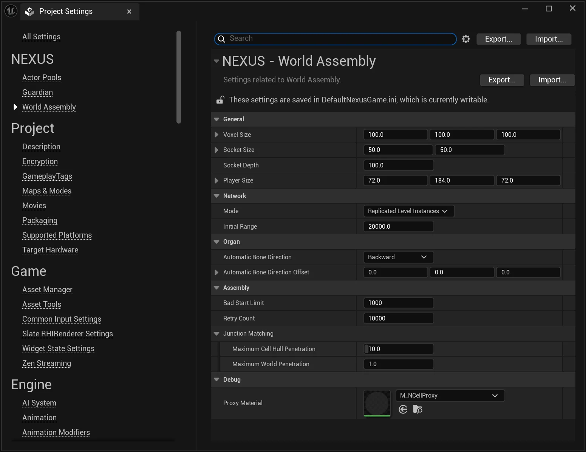

# Project Settings

From the `Edit > Project Settings` window, find the **World Assembly** section.

## Configuration Options

### General

| Setting | Description | Default |
| --- | :-- | :-- |
| `Voxel Size` | What is the size to use when generating voxel data around the space of a NCell. This sizing will also be used to calculate some additional meta data as a unit size. It doesn't need to be too tight; just remember the smaller the size, the greater the performance hit. | `(100, 100, 100)` |
| `Socket Size` | What is the unit base size for things like the junctions and bones. | `(50, 50)` |
| `Socket Depth` | The depth per side of a junction that is used for collision detection in some (PCG) scenarios. | `100.f` |
| `Player Size` | What is the size of the player's collider? | `(72.f, 184.f, 72.f)` |

### Network

| Setting | Description | Default |
| --- | :-- | :-- |
| `Mode` | How should `ANCellLevelInstance`s be replicated to clients, either based on relevancy (proximity) or treated as always relevant. | `ReplicatedLevelInstances` |
| `Initial Range` | The range to query for nearby `ANCellLevelInstance`s by `ANWorldAssemblyRelay`, used to determine if the client is considered loaded. Distance is calculated to the world position point of the `ANCellLevelInstance`. | `20000.f` |

### Organ

| Setting | Description | Default |
| --- | :-- | :-- |
| `Automatic Bone Direction` | The direction used to calculate the automatic bone placement on the volume. | `Backward` |
| `Automatic Bone Direction Offset` | Offset value applied to the direction provided by the enumeration. | `(0,0,0)` |

### Assembly

| Setting | Description | Default |
| --- | :-- | :-- |
| `Retry Count` | The maximum amount of full attempts at assembling a space before it is considered a complete failure. | `10000` |
| `Junction Matching > Cell Penetration Tolerance` | The maximum depth of penetration a cell's hull can penetrate another to make a junction connection. | `10.f` |
| `Junction Matching > World Penetration Tolerance` | The maximum depth of penetration a cell's hull can penetrate world geometry to make a junction connection. | `2.f` |
| `Tagging > Context Tags` | Default `Context Tags` provided to every Assembly Operation. | `(empty)` |
| `Tagging > Starting Counters` | Default `Tag Counters` provided to every Assembly Operation. | `(empty)` |
| `Direction Tolerance` | How close the placement bearing must be to a cell's `Direction Constraint` heading (within this many degrees +/-) for the cell to remain a valid candidate. | `15.f` |
| `Spawning > Cell Time Slice` | Frame-time goal limit when to split spawning cells to the next frame task (in milliseconds). | `1.f` |
| `Spawning > Junction Default Filler` | The default `AActor` (requires `INCellJunctionFiller`-implemented) to use when no filler is available. | `(empty)` |
| `Spawning > Delayed Junction Spawning` | Should time-slicing be used when spawning junction fillers. | `true` |
| `Spawning > Junction Time Slice` | Frame-time goal limit when to split spawning junctions to the next frame task (in milliseconds). | `0.5f` |

### Debug

| Setting | Description | Default |
| --- | :-- | :-- |
| `Proxy Material` | The material to use with the DynamicMeshes as part of `ANCellProxy`. | `M_NCellProxy` |

## See Also

- [User Settings](user-settings.md) — per-user, machine-local editor preferences stored outside project config.