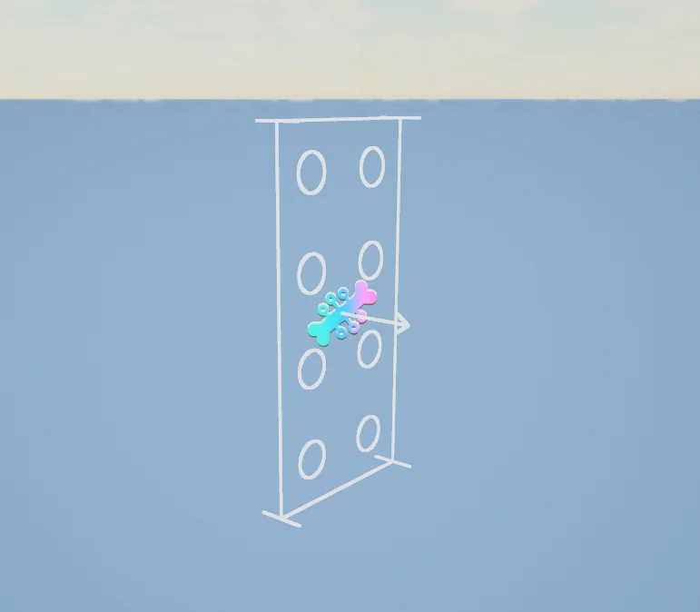
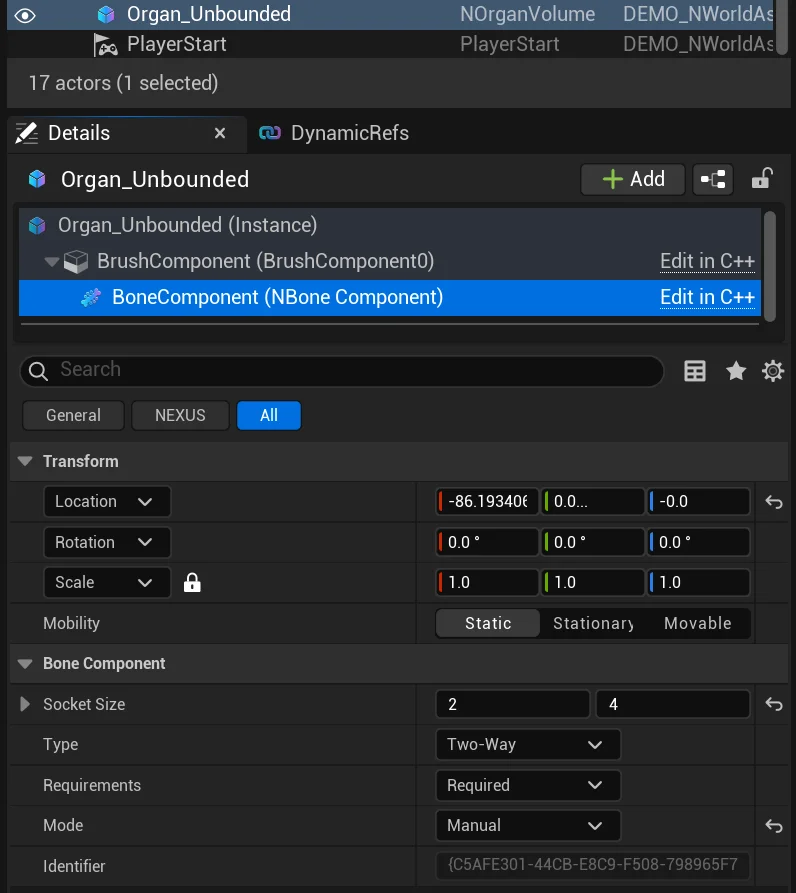
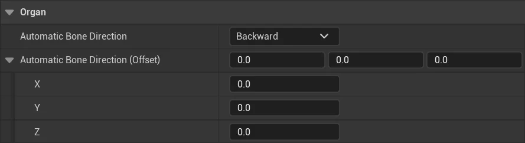

import TypeDetails from '../../../../src/components/TypeDetails';

# Bone Component

<TypeDetails icon="/assets/svg/world-assembly/world-assembly-bone-component.svg" iconType="img" base="USceneComponent" type="UNBoneComponent" typeExtra="" headerFile="NexusWorldAssembly/Public/Organ/NBoneComponent.h" />

:::info[Wikipedia Definition]

A bone is a rigid organ that constitutes part of the skeleton in most vertebrate animals. Bones provide structural support, protect internal organs, enable mobility, and serve as vital sites for producing blood cells and storing minerals.

:::

A **Bone** functions as a connection point outside of a [Cell](cell.md) that is used as a starting point during World Assembly. The overall goal is to connect all encompassed **bones** in an [Organ](organ-volume.md).

The connecting of [Junctions](junction-component.md) to **bones** utilizes the same ruleset for matching that [Junction](junction-component.md)-to-[Junction](junction-component.md) connections must meet.

:::warning

Currently, only the **Bone** built-in to the [Organ](organ-volume.md) is used as a starting point for World Assembly. **Multi-bone** support is targeted for the `0.4.0` release. Explicitly, [Cell](cell.md) placement between bones is not functional, nor is bone-to-bone between [Organs](organ-volume.md).

:::

A **Bone** represents itself in the world as a white-lined [Junction](junction-component.md), with identical indicators.

:::tip[Bone Actor]

A `ANBoneActor` is available for situations where you want a bespoke **Bone**, and do not want to attach a `UNBoneComponent` to another `AActor`.

:::

## Component Details

| Setting | Type | Description | Default |
| :-- | :-- | :-- | :-- |
| Socket Size | `FIntVector2` |  Size of the socket in grid units (width, height), used for matching against [Junctions](junction-component.md). | `(2,4)` |
| Type | `ENCellJunctionType` | **NOT IMPLEMENTED** | `Two-Way` |
| Requirements | `ENCellJunctionRequirements` | **NOT IMPLEMENTED** | `AllowEmpty` |
| Mode | `ENBoneMode`| The **Bone** placement behaviour at author-time. | `Automatic` |
| Identifier | `FGuid` | A pseudo-unique identifier for the **Bone** component. | `N/A` |

## ENBoneMode

| Mode | Description |
| :-- | :-- |
| `Manual` | Allows for manual placement of the Bone inside of it's volume. |
| `Automatic` | Attempts to place the Bone at the extreme of the volume based on the project settings . |
| `Disabled` | Disables the Bone from being used inside of any assembly operation. |

## Project Settings

In `Project Settings > World Assembly > Organ`, the settings for how automatic placement is done in a project gets defined.

| Setting | Type | Description | Default |
| :-- | :-- | :-- | :-- |
| Automatic Bone Direction | `ENDirection` |  The direction to trace out from the center of the volume to the border. | `Backward` |
| Automatic Bone Direction (Offset) | `FVector` |  An offset to apply to the given point determined by the trace above. | `(0,0,0)` |