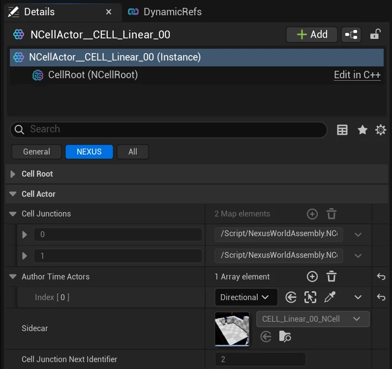
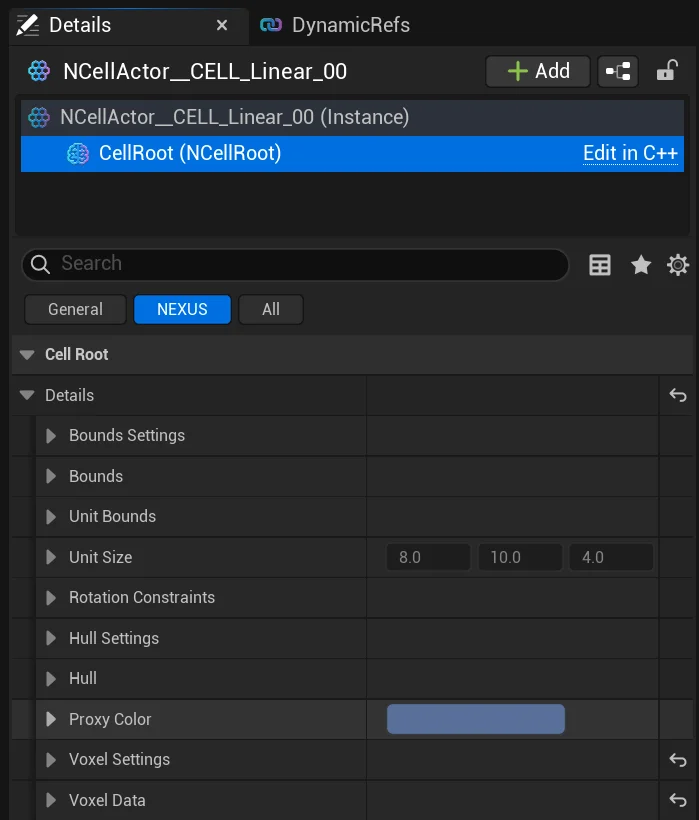

import TypeDetails from '../../../../src/components/TypeDetails';

# Cell

<TypeDetails icon="/assets/svg/world-assembly/world-assembly-cell-data.svg" iconType="img" base="UDataAsset" type="UNCell" typeExtra="" headerFile="NexusWorldAssembly/Public/Cell/NCell.h" />

:::info[Wikipedia Definition]

The basic structural and functional unit of all living organisms. It is the smallest unit of life classified as a living thing, acting as the fundamental building block of all tissues and organs

:::

A cell represents a map's meta-data, allowing it to be placed in a World Assembly operation. It is meant to disconnect the actual `UWorld` (Map) from this data, allowing generation to occur without having to load any of the actual map data itself until it is actually used (`FNSpawnCellProxiesTask`).

This allows for an extremely efficient World Assembly operation, off of the Game Thread.

:::tip

Cell-level instances spawned at runtime/author-time are locked out from editing. Open the source level directly when you need to make changes. See the [Cell Editor](../editor-mode/cell-editor.md) as part of the [Editor Mode](../editor-mode/index.mdx).

:::

## Cell Actor

The `ANCellActor` functions as the _root of all evil_, and also houses the level-side data for the `UNCell`.

| Setting | Description |
|---|---|
| Cell Junctions | Internal mapping of a ticket/identifier to a [Junction](junction-component.md). |
| Author Time Actors | A user-defined list of `AActors` that should be destroyed when a `ANCellLevelInstance` is loaded. Will not effect cell spatial calculations either. | 
| Initialize Callback Actors | Reference list to all `AActors` that implement the [INCellInitialized](cell-initialized.md) interface. Populated automatically during the save process to avoid finding at build time. | 
| Sidecar | Soft-pointer to the associated side-car data (`UNCell`) for the level. |
| Cell Junction Next Identifier | Storage for the next internal ticket/identifier. | 

## Cell Root Component

The `UNCellRootComponent` represents the data which is going to get mirrored into the `UNCell` when saved.

### Bounds Settings

| Setting | Type | Description | Default |
|---|---|---|---|
| Calculate On Save | `bool` | Should the bounds of the cell be calculated / updated on save. | `true` |
| Include Non Colliding | `bool` | Include non-colliding `AActors` in bounds calculations. | `false` |
| Include Editor Only | `bool` | Include `AActors` flagged as `EditorOnly` in bounds calculations. | `false` |
| Actor Ignore Tags | `TArray<FName>` | `AActor`'s with these tags will be ignored during bounds calculations. | `NCell_Ignore`, `NCell_BoundsIgnore` |

### Rotation Constraints

The cell exposes a dual-interval `FNRotationConstraints` set. The _matching_ interval constrains a candidate rotation's own pose; the _difference_ interval constrains the delta between two rotations. Either interval can be enabled independently.

| Setting | Type | Description | Default |
|---|---|---|---|
| Enforce Matching? | `bool` | Enables the matching-interval test on the candidate rotation itself. | `true` |
| Minimum Matching Rotation | `FRotator` | Lower bound (inclusive) of the matching interval. | `(0,0,-180.f)` | 
| Maximum Matching Rotation | `FRotator` | Upper bound (inclusive) of the matching interval. | `(0,0,180.f)` |
| Enforce Difference? | `bool` | Enables the difference-interval test on the delta between two rotations. | `false` |
| Minimum Difference Rotation | `FRotator` | Lower bound (inclusive) of the difference interval. | `(0,0,-180.f)` |
| Maximum Difference Rotation | `FRotator` | Upper bound (inclusive) of the difference interval. | `(0,0,180.f)` |

### Hull Settings

| Setting | Type | Description | Default |
|---|---|---|---|
| Calculate On Save | `bool` | Should the hull be calculated / updated on save. | `true` |
| Allow Non Convex | `bool` | Allow the hull to be non-convex; creating a complex collision mesh. There is a **performance cost** to using non-convex meshes inside of an assembly operation, choose wisely. | `false` |
| Include Non Colliding | `bool` | Include non-colliding `AActors` in hull calculations. | `false` |
| Include Editor Only | `bool` | Include `AActors` flagged as `EditorOnly` in hull calculations. | `false` |
| Build Method | `ENullBuildMethod` | This is the method/version used by Chaos to create the convex hull initially. It is currently locked out due to some of the newer versions of the system producing n-gons. | `Original` |
| Actor Ignore Tags | `TArray<FName>` | `AActor`'s with these tags will be ignored during hull calculations. | `NCell_Ignore`, `NCell_HullIgnore` |

### Proxy Color

### Voxel Settings

| Setting | Type | Description | Default |
|---|---|---|---|
| Use Voxel Data | `bool` | ***Voxel data is currently ignored.*** Should a cell's voxel data be used in assembly operations. | `false` |
| Calculate On Save | `bool` | Should the voxel data of the cell be calculated / updated on save. | `true` |
| Include Non Colliding | `bool` | Include non-colliding `AActors` in voxel data calculations. | `false` |
| Include Editor Only | `bool` | Include `AActors` flagged as `EditorOnly` in voxel data calculations. | `false` |
| Actor Ignore Tags | `TArray<FName>` | `AActor`'s with these tags will be ignored during voxel data calculations. | `NCell_Ignore`, `NCell_VoxelIgnore` |
| Collision Channel | `ECollisionChannel` | The collision channel used when tracing for collisions to determine occupancy. | `WorldStatic` |

## Side-Car Data

Each cell is stored as a side-car asset (`<CellName>_NCell.uasset`) that lives next to the source level. The side-car holds the cached bounds, hull, voxel data, junction set, and a thumbnail snapshot of the level — none of which require the level itself to be loaded for the assembly task graph to schedule work against the cell.

When a thumbnail is captured for the `ANCellActor` in the level editor (via the **Capture Thumbnail** menu option in [Cell Editor](../editor-mode/cell-editor.md)), it propagates (with gizmos) to the side-car automatically so the cell shows similar preview in the content browser as the source level.

The side-car asset's content-browser context menu includes a **Select Level** action button that jumps to the source level in the content browser — handy when triaging a generation result and you need to open the source map for the cell that produced a particular proxy.
