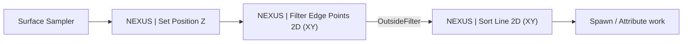

import DocCardList from '@theme/DocCardList';

# Elements

World Assembly ships a handful of [PCG](https://dev.epicgames.com/documentation/en-us/unreal-engine/procedural-content-generation-framework-in-unreal-engine) nodes, all under the **NEXUS** category in the PCG graph editor. Mirrors the layout of `NexusWorldAssembly/Public/Elements/`.

They exist because laying out a floorplan is a 2D problem that PCG's stock nodes solve awkwardly. A grid of points is easy to produce and hard to turn into *an ordered boundary with corners identified* — which is what you need before you can place bones, walls, or junctions along it. These nodes cover that gap.

A typical chain flattens a sampled volume onto one plane, keeps only its border, then walks that border into an ordered line with each point classified:

Two further nodes read live junction data out of the world rather than shaping points, and are documented alongside the component they read — see [Junction Component → PCG Integration](../junction-component.md#pcg-integration).

## The Settings / Element Split

Every node here is a pair, which is PCG's own convention rather than anything NEXUS invented:

- **`UN…Settings`** (a `UPCGSettings`) is the node as you see it in the graph — its title, colour, pins, and authored properties.
- **`FN…Element`** (an `IPCGElement`) is the executor. It holds no state; it reads the settings and transforms the data.

The pages below document the settings half, since that is the half you configure. Where the element half carries behaviour worth knowing — caching, threading, testable helpers — it is called out on the page.

<DocCardList />
