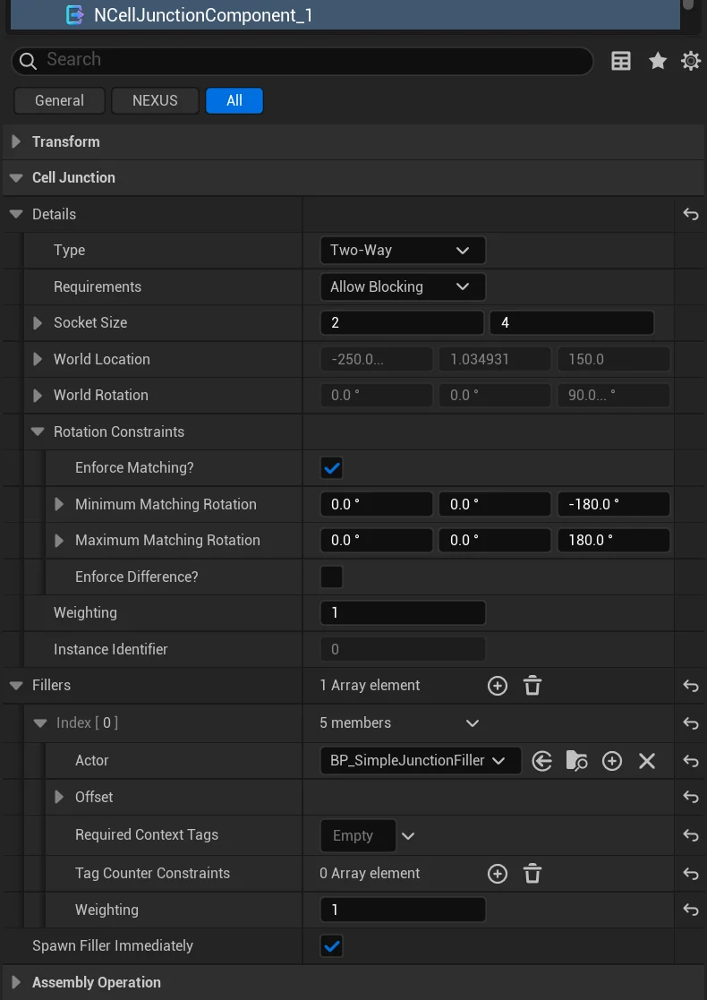
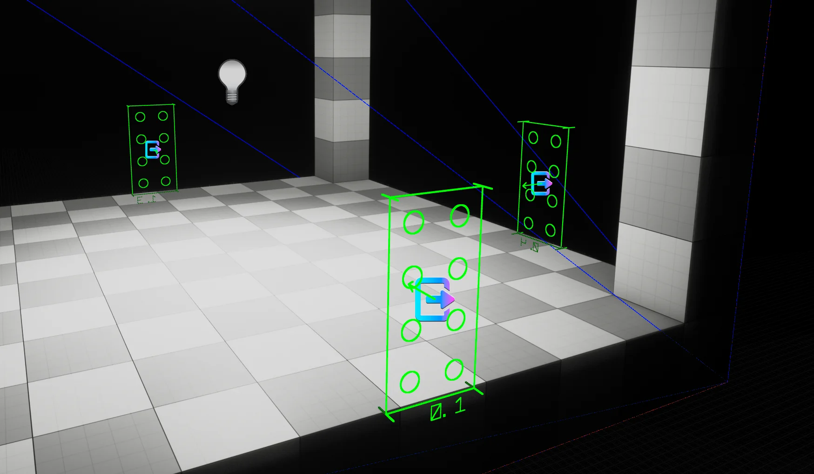
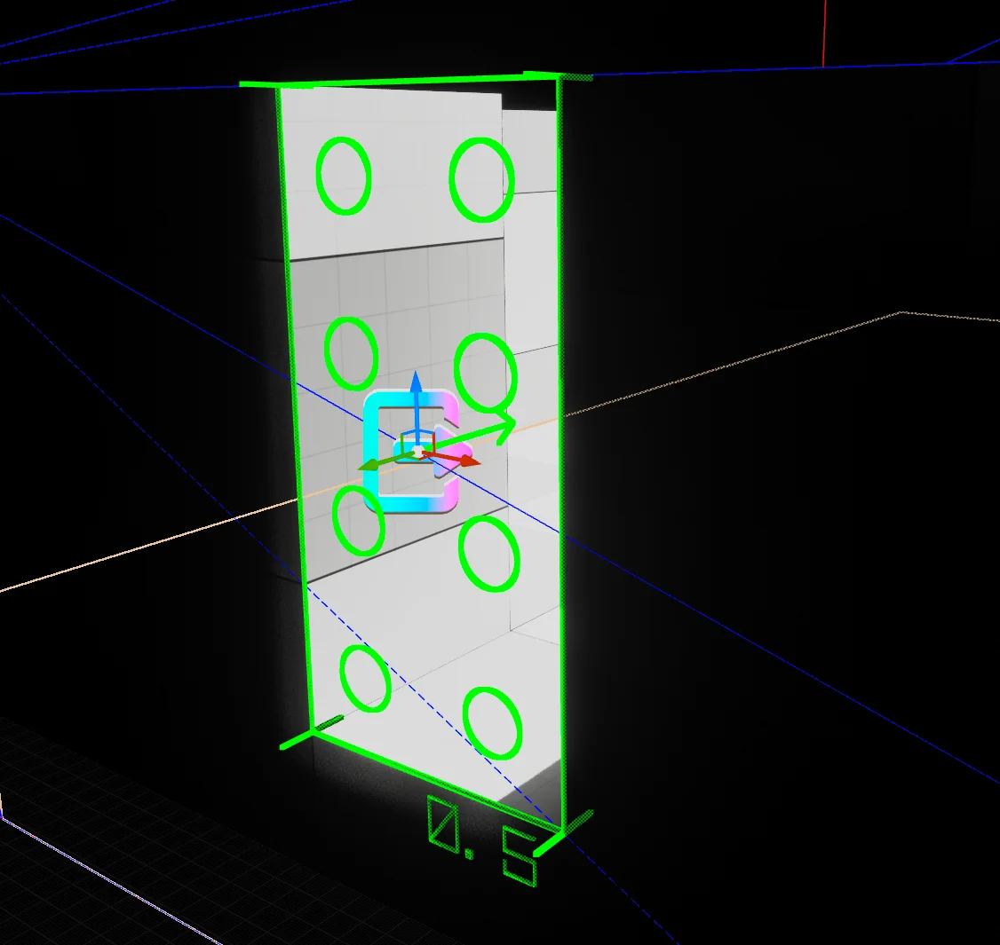
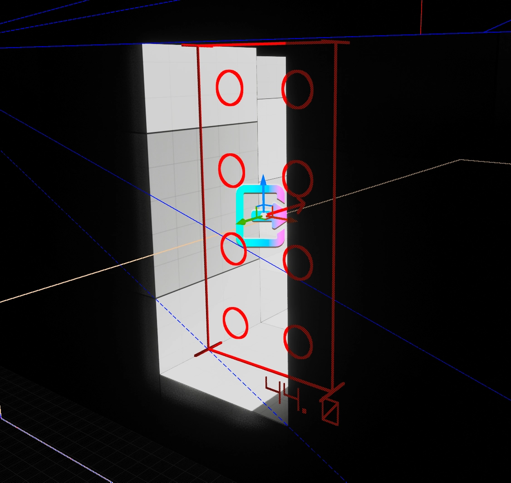

import TypeDetails from '../../../../src/components/TypeDetails';

# Junction Component

<TypeDetails icon="/assets/svg/world-assembly/world-assembly-junction-component.svg" iconType="img" base="USceneComponent" type="UNCellJunctionComponent" typeExtra="" headerFile="NexusWorldAssembly/Public/Cell/NCellJunctionComponent.h" />

:::info[Wikipedia Definition]

Cell junctions are a class of cellular structures consisting of multiprotein complexes that provide contact or adhesion between neighboring cells or between a cell and the extracellular matrix in animals.

:::

A Junction serves as a sized (XY) connection point between two [Cells](cell.md). During the assembly process, Junctions are used to determine if a Cell can be attached based on its own collision data, `Socket Size` and additional constraints.

In [Returnal](https://housemarque.com/games/returnal), when looking at the area map, you can clearly see where its junctions are, and if they have been filled or connected to other areas.

## Creating Junctions

A Junction is represented in the world by adding a `UNCellJunctionComponent` to an object in the world. This can be done while in `World Assembly Mode` for a NCell, and selecting the Junction dropdown's **Add Component**.

A Junction will only persist on a Cell if the level contains a `UNCellRootComponent`. If you add one to a level without a root, the component will log an error and remove itself on the next tick. Each surviving Junction is automatically registered against the owning `ANCellActor` and assigned a stable `InstanceIdentifier`, which is what the side-car data used during generation keys off of.

## Component Details

### Details

| Setting | Type | Description | Default |
|---|---|---|---|
| Type | `ENCellJunctionType` | **NOT IMPLEMENTED** | `Two-Way` |
| Requirements | `ENCellJunctionRequirements` | How an unconnected junction is resolved after the graph is linked. `Required` — the junction must connect to another for the graph to be considered valid, and its selection weight is automatically **doubled**; `Allow Blocking` — a junction left unconnected is [filled](#fillers); `Allow Empty` — a junction left unconnected stays unfilled. | `AllowBlocking` | 
| Socket Size | `FIntVector2` | Size of the junction socket in grid units (width, height) | `(2,4)` | 
| Rotation Constraints | `FNRotationConstraints`| What rotations can be made by this junction to match another. | |
| Weighting | `int32` | Relative weight against other junctions in the cell for selection. | `1` | 

### Fillers

When a junction is left **unconnected** at the end of generation, World Assembly can spawn a _filler_ actor to cap it — closing the opening with a wall, door, cover piece, or any other actor you author. Each junction carries an array of `FNCellJunctionFillerEntry` candidates; at fill time the owning cell gates them by their constraints, picks one weighted-at-random from the survivors, and spawns it. When no entry qualifies, the project-wide `Junction Default Filler` (see [Project Settings](../project-settings.md)) is used instead.

The spawned actor **must** implement [INCellJunctionFiller](cell-junction-filler.md); it receives an `OnInitializedFromJunction` callback so it can size or configure itself from the junction it fills.

| Setting | Type | Description | Default |
|---|---|---|---|
| Actor | `TSubclassOf<AActor>` | The actor to spawn when this entry is selected. Must implement [INCellJunctionFiller](cell-junction-filler.md). | `(None)` |
| Offset | `FTransform` | Placement offset relative to the junction's frame: the location is rotated by the junction's orientation before being added, the rotation spins the actor in place, and the scale multiplies the actor's own scale. | `Identity` |
| Required Context Tags | `FGameplayTagContainer` | Tags that must be present in the generated cell's `Context Tags` for this entry to be eligible. | `(Empty)` |
| Tag Counter Constraints | `TArray<FNGameplayTagCounterConstraint>` | `Tag Counter` constraints that must **all** pass for this entry to be eligible. A constrained tag absent from the counter compares as `0`. | `(Empty)` |
| Weighting | `int32` | Relative weight for random selection among eligible entries. Higher values are more likely to be chosen. | `1` |

#### Spawn Filler Immediately

| Setting | Type | Description | Default |
|---|---|---|---|
| Spawn Filler Immediately | `bool` | Bypass filler time-slicing and spawn this junction's filler immediately during `BeginPlay`, rather than spreading the work across frames. | `false` |

Time-slicing of filler spawns is otherwise governed project-wide by `Delayed Junction Spawning` and `Junction Time Slice` (see [Project Settings](../project-settings.md)).

### Callbacks

| Setting | Type | Description | Default |
|---|---|---|---|
| BeginPlay | `TArray<TObjectPtr<AActor>>` | Actors notified during the junction's `BeginPlay`. Each assigned actor that implements [INCellJunctionBeginPlay](cell-junction-begin-play.md) receives an `OnJunctionBeginPlay` call carrying the junction's resolved link details (`FNCellLinkDetails`), letting it react to how the junction was wired up during assembly. The field only accepts actors implementing that interface. | `(Empty)` |

Unlike a [Filler](#fillers) — which the junction *spawns* to cap an unconnected opening — a BeginPlay callback target is an actor that already exists in the cell and simply wants to know how its junction resolved.

## Gizmo

The in-editor drawing of the Junction is meant to convey specific information about the settings of the Junction.

### Sizing

The circular nubs are representative of the size and scale of the defined `Socket Size`.

### Directionality

The arrow in the middle indicates the forward direction of the **Junction**.

:::important[Facing Direction]

It is important that the direction of the **Junction** in a Cell always faces inwards.

:::

### Color

When in `World Assembly Mode`, the gizmo color is derived from the penetration depth into the [UNCell](cell.md)'s hull. So long as it remains green the junction is matchable and will not be excluded due to the depth setting (see `Cell Penetration Tolerance` in the [Project Settings](../project-settings.md)). 

:::danger

If it is **RED**, it's dead.

:::

### Corner Points

The corner-point lines indicate the junction's `Type` — `Two-Way`, `In-Only`, `Out-Only`, or `One-Way`.

## Penetration Matching

There is nothing novel about the idea of stitching a map together from discrete pieces — where `NWorldAssembly` shines is in its ability to overcome hurdles that still show up in games today. By planning for penetration testing from the start it can avoid the gaps commonly associated with stitching. An example of the gaps can be seen in this image from the recent, [SAROS](https://housemarque.com/games/saros).

