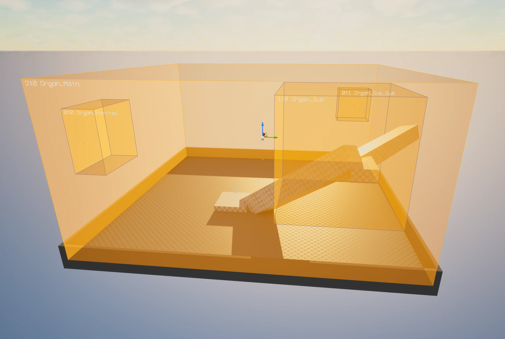
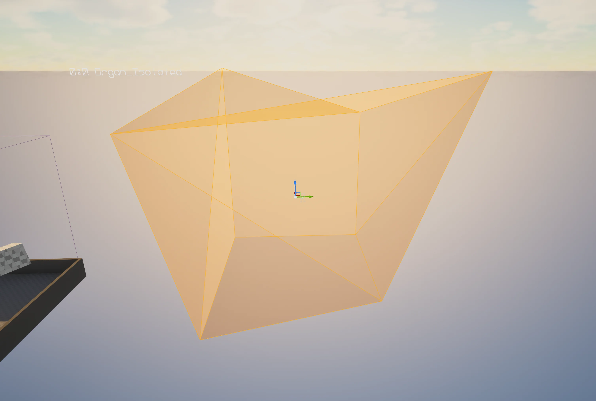
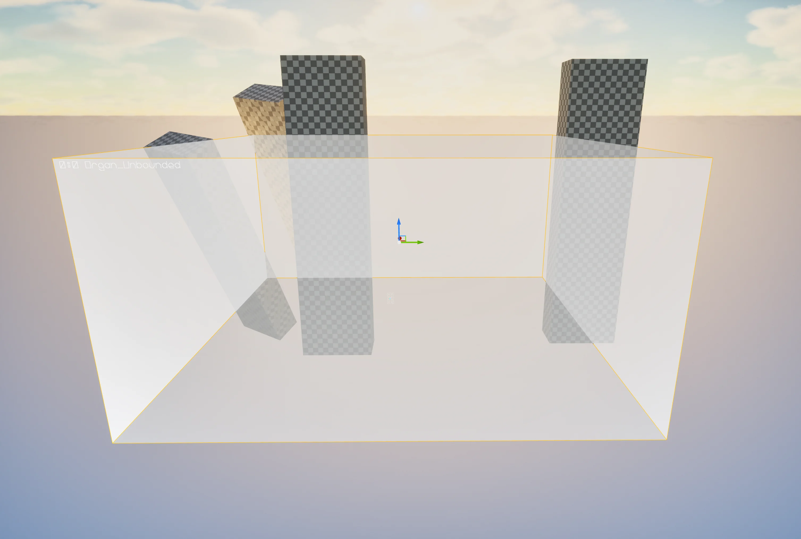
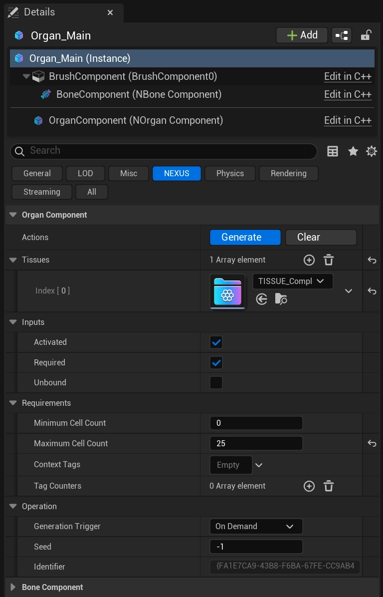

import TypeDetails from '../../../../src/components/TypeDetails';

# Organ Volume

<TypeDetails icon="/assets/svg/world-assembly/world-assembly-organ-volume.svg" iconType="img" base="AVolume" type="ANOrganVolume" typeExtra="" headerFile="NexusWorldAssembly/Public/Organ/NOrganVolume.h" />

:::info[Wikipedia Definition]

A bone is a rigid organ that constitutes part of the skeleton in most vertebrate animals. Bones provide structural support, protect internal organs, enable mobility, and serve as vital sites for producing blood cells and storing minerals.

:::

An Organ represents a spatial unit where World Assembly of [Cells](../types/cell.md) (via [Tissues](../types/tissue.md)) should be generated. 
Organs can have sub-organs, and generation will account for and determine the most parallelizable order possible.

## Actions

When you have an Organ selected,  it's component has some action buttons available to **Generate** and **Clear**, similar to the [Organ Menu](../editor-mode/organ-editor.md#organ-menu) as part of the [World Assembly Editor Mode](../editor-mode/index.mdx).

## Component Settings

| Setting | Type | Description | Default |
|---|---|---|---|
| Activated | `bool` | Should this Organ be included in World Assembly? | `true` |
| Generation Trigger | `ENOrganGenerationTrigger` | Determine if the Organ should automatically queue itself for generation on `Begin Play` or indicate that it will be manually generated `On Demand`. | `OnDemand` |
| Seed | `int32` | Overrides the seed passed to the `FNVirtualOrganContext`, used for deterministic random for this given Organ during its assembly operation. If the value is `-1` it will not override, and preserves the passed seed. | `-1` |
| Unbounded | `bool` | Should the Organ **NOT** enforce that placed Cells during generation fall within it's bounds / brush. | `false` |
| Minimum Cell Count | `int32` | An optional minimum required placed cell count that will invalidate an assembly operation if it is not met. `-1` leaves this feature disabled. | `-1` |
| Maximum Cell Count | `int32` | An optional maximum required placed cell count that will invalidate an assembly operation if it is not met. `-1` leaves this feature disabled. | `-1` |
| Tissues | `TArray<UNTissue>` | An array of [Tissues](../types/tissue.md) defining what should be used to populate an Organ. | `(empty)` |
| Identifier | `FGuid` | A constructor generated identifier used to sort Organs. | `<ctor>` |