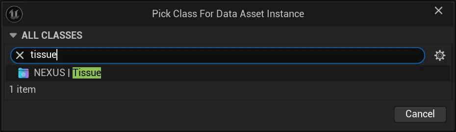

import TypeDetails from '../../../../src/components/TypeDetails';

# Tissue

<TypeDetails icon="/assets/svg/world-assembly/world-assembly-tissue.svg" iconType="img" base="UDataAsset" type="UNTissue" typeExtra="" headerFile="NexusWorldAssembly/Public/Cell/NTissue.h" />

:::info[Wikipedia Definition]

An ensemble of similar (or dissimilar in structure but same in origin) cells that together carry out a specific function.

:::

A tissue defines the [Cells](../concepts/cell/index.md) which can be used in that specific tissue. If multiple **Tissues** are assigned to an [Organ](../concepts/organ/index.md) a combinatory effect will apply where all **tissue** entries will be flattened down into a single list, similarly to how **sub-tissues** work.

## Creating

A `UNTissue` can be created through the common `UDataAsset` creation wizard. 

Or as added bonus it  can be created through it's own direct asset factory from the **Content Browser** context-menu, under `NEXUS > NTissue`.

## Dataset

### Tag Groups

These are collections of tags that correspond to specific described behavior when used. They pull their possible tags from `NEXUS.WorldAssembly.*`. User-created tags should be added under that namespace if you wish for them to show up in the details inspector.

#### Unique

Identifing a `FGameplayTag` as part of `Tag Groups > Unique` will create a behavioral contract during the assembly operation of an `UNOrganComponent` that ensures that once a Cell is placed that has that `FGameplayTag` as part of its `Assembly Tags`, no other Cell with that `FGameplayTag` can be used.

> As an example, you may want to have only one **hero** peice appear in a given assembly operation. You could add your `Hero` tag to all the **hero** Cell entries in their `Assembly Tags` and would then also add it to the `Tag Groups > Unique`. 

#### RequiredAny

When a `FGameplayTag` is added to `Tag Groups > Required (Any)`, after the generation of the `Cell Graph` during an assembly operation, the graph will be validated to ensure that any `UNCell` were used that had this `FGameplayTag` associated to it via `Assembly Tags`. If it does not, the graph is regenerated.

#### Unique & RequiredAny Special Behavior

A common requirement when generating gameplay spaces is ensuring that there is some sort of Boss encounter. This is where combining `Unique` and `RequiredAny` have a compound effect with a little extra magic behind the scenes. In a contrived example, you would have two `UNCell` boss-room entries, both would be set to have a `MinimumCount` and `MaximumCount` of `1`, and would get tagged with some `FGameplayTag` that ends up in `Tag Groups > Unique` and `Tag Groups > Required (Any)`. When it's setup like this, the the `MinimumCount` is ignored, as well as the "every" part of `Required` when validating the graph.

### Cells

| Settings | | Default |
| --- | --- | --- |
| Assembly Tags | Tags used to define behavior during the assembly process, pulled from `NEXUS.WorldAssembly.*`. _See [Tagging](../tagging.md#assembly-gameplay-tags)_ | `(Empty)` |
| Output Tags | Tags which get accumulated based on `UNCell` usage, and provided for context post-assembly. Accessible by `INCellInitialized` interface via the `ANCellLevelInstance`. | `(Empty)` |
| Always Relevant | Whether the `ANCellLevelInstance` should be spawned always relevant for networking purposes | `false` | 
| Minimum Count | ***NOT IMPLEMENTED*** Only used for determine specific-unique case exclusion (_not tag related_). | `-1` |
| Maximum Count | The maximum number of times this cell can be used in the generated `FNAssemblyGraph`. (_-1 no constraint_) | `-1` | 
| Minimum Node Distance | The minimum number of cell links away this cell must be to be used again. | `1` | 
| Minimum Node Depth | The minimum number of nodes away from the start when this can be used. | `0`  |
| Weighting | Relative weight for random selection during generation. | `1`| 
| Cell | A soft-object reference to the `UNCell` asset that will be consumed. | `n/a` | 