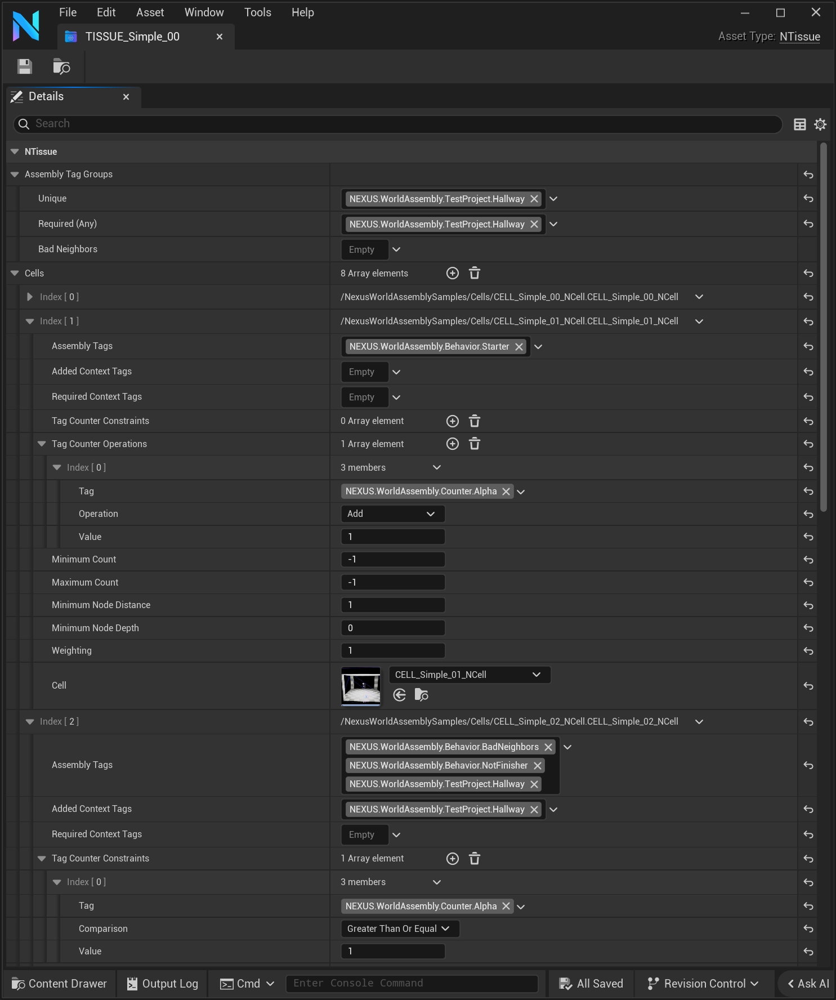

import TypeDetails from '../../../../src/components/TypeDetails';

# Tissue

<TypeDetails icon="/assets/svg/world-assembly/world-assembly-tissue.svg" iconType="img" base="UDataAsset" type="UNTissue" typeExtra="" headerFile="NexusWorldAssembly/Public/Cell/NTissue.h" />

:::info[Wikipedia Definition]

An ensemble of similar (or dissimilar in structure but same in origin) cells that together carry out a specific function.

:::

# Tissue

A tissue defines the [Cells](../concepts/cell/index.md) which can be used in that specific tissue. If multiple **Tissues** are assigned to an [Organ](../concepts/organ/index.md) a combinatory effect will apply where all **tissue** entries will be flattened down into a single list, similarly to how **sub-tissues** work.

