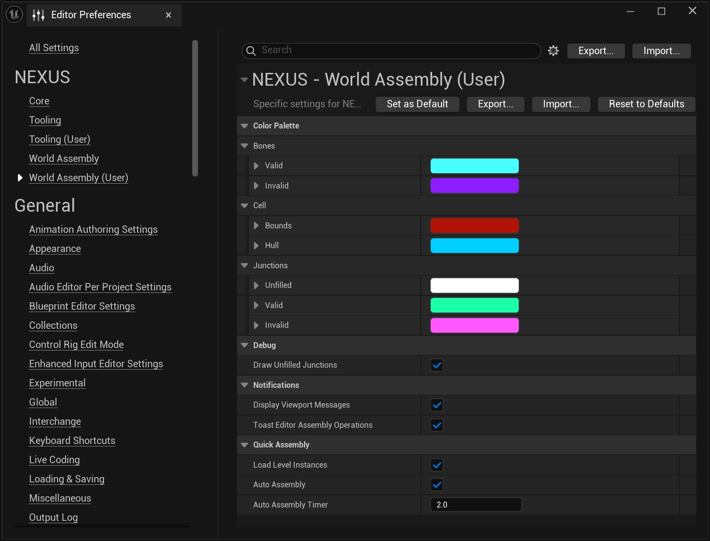

# User Settings

Per-user editor preferences for World Assembly. Unlike the shared [Project Settings](project-settings.md) and project-shared [Editor Settings](editor-settings.md), these are machine-local and stored in `NexusUserSettings.ini`, so each developer keeps their own values and they do not leak into source control.

From the `Edit > Editor Preferences` window, find the **World Assembly (User)** section.

## Configuration Options

### Color Palette

The `Color Palette` groups drive the gizmos and debug markers drawn in the viewport while [editing](editor-mode/index.mdx) and during a [Quick Assembly](editor-mode/organ-editor.md#quick-assembly) operation — for example colouring junctions differently depending on whether they ended up valid, invalid, or unfilled. Defaults below are shown as their sRGB hex equivalents.

#### Bones

| Setting | Type | Description | Default |
| :-- | :-- | :-- | :-- |
| `Valid` | `FLinearColor` | Color of a [bone](types/bone-component.md) that resolved to a valid (matchable) connection. | Cyan `#46FFFF` |
| `Invalid` | `FLinearColor` | Color of a [bone](types/bone-component.md) that could not be matched. | Violet `#8A1EFF` |

#### Cell

| Setting | Type | Description | Default |
| :-- | :-- | :-- | :-- |
| `Bounds` | `FLinearColor` | Color used to draw a [cell](types/cell.md)'s bounds. | Red `#B01406` |
| `Hull` | `FLinearColor` | Color used to draw a [cell](types/cell.md)'s hull. | Sky Blue `#00D0FF` |

#### Junctions

| Setting | Type | Description | Default |
| :-- | :-- | :-- | :-- |
| `Unfilled` | `FLinearColor` | Color of a [junction](types/junction-component.md) left unfilled during a world assembly operation. Used when `Draw Unfilled Junctions` is enabled. | White `#FFFFFF` |
| `Valid` | `FLinearColor` | Color of a [junction](types/junction-component.md) that resolved to a valid connection. | Spring Green `#1AFFA8` |
| `Invalid` | `FLinearColor` | Color of a [junction](types/junction-component.md) embedded too far into geometry to be matched. | Magenta `#FF58FF` |

### Debug

| Setting | Type | Description | Default |
| :-- | :-- | :-- | :-- |
| `Draw Unfilled Junctions` | `bool` | Draw debug markers for unfilled (unconnected) [junctions](types/junction-component.md) in the world preview. | `true` |

### Notifications

| Setting | Type | Description | Default |
| :-- | :-- | :-- | :-- |
| `Display Viewport Messages` | `bool` | Show relevant alerts and messages in the viewport's upper-left corner while editing cells. | `true` |
| `Toast Editor Assembly Operations` | `bool` | Show a toast notification when an editor-triggered Assembly Operation completes, and summarize [Quick Assembly](editor-mode/organ-editor.md#quick-assembly) (including Auto Assembly) runs. | `true` |

### Quick Assembly

| Setting | Type | Description | Default |
| :-- | :-- | :-- | :-- |
| `Load Level Instances` | `bool` | Create and load the level instances from the `ANCellProxy`(s) produced by a [Quick Assembly](editor-mode/organ-editor.md#quick-assembly), carrying the result all the way through to actualized `ANCellLevelInstance`s. | `true` |
| `Auto Assembly` | `bool` | Continuously re-trigger Assembly Operations for the target [Organ](types/organ-volume.md) on a timer until cancelled. | `false` |
| `Auto Assembly Timer` | `float` | Seconds to wait after a run completes before the next Auto Assembly is triggered. Only used when `Auto Assembly` is enabled. Clamped to `2`–`180`. | `2` |

## See Also

- [Project Settings](project-settings.md) — shared, project-wide runtime configuration saved to project config.
- [Editor Settings](editor-settings.md) — project-shared editor defaults for new cells and the collision visualizer.
