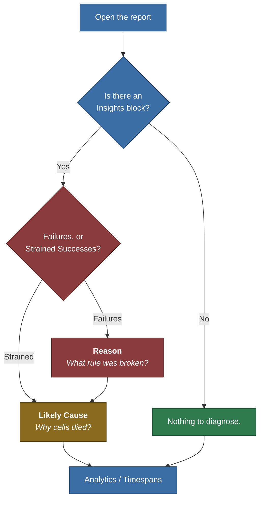

# World Assembly: Decoding The Log

Every time World Assembly runs, it leaves a receipt.

It is a Markdown file that lands beside your project's other logs, and it is the difference between *"the level came out wrong"* and *"this failed to generate" and "this failed because seventy-two percent of the cell placements were on top of each other."* 

> The [Analytics](/docs/world-assembly/architecture/analytics/) page covers the finer details, but this page is about what to **do** with them, as they are what back the report/log file.

## Where Are The Logs?

### The Receipt

Every operation writes one file, at the moment it finishes, to your project's log directory:

```text
<YourProject>/Saved/Logs/NEXUS_WorldAssembly_<YYYYMMDD>_<HHMMSS>.md
```

The timestamp is the only thing separating one run from the next, so a session of iterating leaves a **pile** of them. Comparing a good run against the run right after your change is most of the value here. It does however create the tradeoff that the folder grows. Sorting by modified time and reading the newest is almost **always** what you want.

> It uses markdown for reasons that all of our default viewers support Markdown and pretty tables. It also forced a limit to how much content we put in the receipt, i.e. it needed to be digestable.

### Two Shortcuts

You should rarely need to go hunting in `Saved/Logs` at all:

| Where | Reference | What |
| :-- |:-: | :-- |
| **Toast** |  |  When an editor-triggered operation finishes, the notification carries a **hyperlink named after the file**. Clicking it opens the report in your default application. Requires [`Toast Editor Assembly Operations`](/docs/world-assembly/user-settings/#notifications). |
| **Rail** |  | The [Operations](/docs/world-assembly/editor-mode/organ/#last-run) block at the bottom of the Editor Mode's Organ rail keeps an **Open Report** link for the last finished run, long after the toast has expired. Hover it to see the full path. |

:::warning[No receipts in shipping]

The entire report system lives inside `#if !UE_BUILD_SHIPPING`. In a shipping build there are no timers, no counters, no report, and no file. This is a development and debugging tool **ONLY**.

:::

## The Shape Of The File

There are four top-level blocks that will always appear.

| Block | Heading | What it answers |
| :-- | :-- | :-- |
| 1 | *The operation's name* | Did it work, how long did it take, and nested underneath, **Insights**, the possible-diagnosis. |
| 2 | `Inputs` | What you asked for: which organs, what they contain, and what order they built in. |
| 3 | `Output` | What came out the other side, expressed as tags. |
| 4 | `Analytics` | Where the time went across the stages and operations. |

## Diagnosis Process

When in doubt, follow the flowchart to lead you to the answer you need.



Three columns carry almost all of the useful information, **Reason** tells you which rule was broken, **Likely Cause** tells you where candidate cells were dying, and the **Overview** table tells you which stage to go read in detail. Everything else in the file is supporting evidence for those three.

## The Header Line

The first block is a simple bit of information about the assembly operation this report is for:

```markdown
| Ticket | Lock Status | Result | Runtime |
| --- | --- | --- | --- |
| 2 | Yes | OK (1/1) | 451.033708 |
```

| Column | Reading |
| :-- | :-- |
| `Ticket` | The operation's unique id, allocated from a running counter. This is what correlates the report with the Developer Overlay, the Operations panel, and any `Ticket(n)` line in the Output Log. |
| `Lock Status` | Whether the operation's context was locked — its inputs frozen and preprocessed before the build. A finished run reads `Yes`. |
| `Result` | `OK (n/n)` or `n/n FAILED`, counting **organs**. |
| `Runtime` | Total measured stage time, in **milliseconds**. |

:::warning[Runtime is a sum, not a stopwatch]

That number is every stage's measured duration **added together**: task-graph creation, the world capture, every organ build, every pass, the connector stage, graph evaluation, and every spawn slice.

Organ builds run **concurrently**, one task per activated organ. Three organs taking 300 ms each in parallel contribute 900 ms to this figure and roughly 300 ms to your wall clock. Spawning is time-sliced across frames, so its contribution is *work* time, not elapsed time — a 50 ms spawn total may well have taken a second and a half of real time to drain.

Use `Runtime` to compare two runs of the same scene against each other. Do not use it to answer "how long will my player wait".

:::

## Insights

Only present when there is something to say. It has two children, either or both of which may appear.

### Failures

```markdown
| Organ | Cells | Likely Cause | Reason |
| --- | --- | --- | --- |
| 0:0_NOrganVolume0 | 0 | - | Organ context failed validation; build was not attempted. |
```

`Cells` reads as `produced / min required` when a minimum was set, and as a bare count when it was not. A lone `0` with no minimum means the organ was expected to produce *something* and did not.

### Strained Successes

The block worth caring about on a run that is **working**.

```markdown
| Organ | Retries | Likely Cause |
| --- | --- | --- |
| 0:0_Organ_Unbounded | 115 / 10000 | Intersecting Cell (28341, 72%) |
```

An organ listed here passed validation, but only after throwing away and rebuilding its graph — in this case 115 times. That is not a failure today. It is an organ one authoring change away from being a failure tomorrow, and the `Likely Cause` column names the rejection that nearly stopped it. The budget it is measured against is [`Retry Count`](/docs/world-assembly/project-settings/#assembly) in the Project Settings, which defaults to a generous `10000` — so "115 retries" reads as comfortable until you notice it cost a third of a second.

:::tip[Watch this column across runs, not within one]

Retries are seed-dependent. One run at 115 is noise; the same organ sitting between 90 and 200 across a dozen seeds is a design that only ever fits by luck.

:::

### Reading Likely Cause

Both tables share this column, and it has a fixed grammar:

```text
World Colliding (412, 78%)
|_____________|  |___| |_|
     reason      count  share of all placement attempts
```

The percentage denominator is **every placement attempt** — all rejections plus every cell that was successfully added — so `78%` reads as *"four in five candidate placements were thrown out by world geometry."*

There are five possible reasons, and a `-` when nothing was rejected at all:

| Reason | Candidates were dying because | Usually means |
| :-- | :-- | :-- |
| `World Colliding` | They hit existing world geometry. | The space handed to the organ is not as empty as it looks. |
| `Existing Node Colliding` | They hit cells **another organ** already placed. | Overlapping organs, or a generation order that puts the greedy one first. |
| `Intersecting Cell` | They hit cells **this organ** already placed. | Cells too large for the volume, or too few junction directions to spread out. |
| `Out Of Bounds` | They fell outside the organ's volume or its height band. | Bounds too tight for the cell footprint; check `Minimum Floor` / `Maximum Ceiling`. |
| `Non-Finisher Constraint` | A finisher cell was required and the candidate was not one. | The tissue has too few finisher-eligible cells to cap its branches. |
| `-` | Nothing was rejected. | The build bailed out before placement ever started — read `Reason` instead. |

Start-cell and later-cell variants of the same physical reason are folded together here, so `World Colliding` covers both "could not place the starter" and "could not grow past node forty".

### Reading Reason

`Failures` carries a second column that `Strained Successes` does not, because a failure has a *specific* rule it broke. There are two families.

**Bail-outs**, recorded before a graph exists at all. These are setup problems, and they are quoted verbatim:

| Reason | What to check |
| :-- | :-- |
| `Organ context failed validation; build was not attempted.` | The organ has no tissues, no cells in its tissues, no bone, or no starting junction sized to that bone. The Output Log will have named which. |
| `Unable to place a starting cell (no valid starter cell available or every candidate collided).` | There is no starter-eligible cell, or every position tried was blocked. |
| `Starting graph contained no nodes after placement.` | The starter placed but produced no node — effectively the same class of problem. |
| `Starter cell has no open junctions; the graph cannot grow past it.` | The starter cell is a dead end. Almost always the wrong cell marked as a starter. |
| `Operation was cancelled before the organ build started.` | Not a defect. Somebody hit cancel. |

**Validation failures**, prefixed `CheckGraph FAILED:`, recorded when a graph was built and then rejected. These carry their numbers inline:

| Reason | Meaning |
| :-- | :-- |
| `CellNodeCount(n) < MinimumCellCount(m)` | The graph came up short of the organ's `Minimum Cell Count`. |
| `CellNodeCount(n) > MaximumCellCount(m)` | It overshot `Maximum Cell Count`. |
| `Cell UsedCount(n) < MinimumCount(m)` | A specific cell's own per-cell minimum was not met. |
| `RequiredContextTags(...) not met (...)` | The organ's required [Context Tags](/docs/world-assembly/tagging/) never appeared. Both sets are printed. |
| `RequiredTagCounters were not met` | A tag-counter constraint on the organ was not satisfied. |
| `HasAllRequiredAnyTags(...) != PlacedGroupTags(...)` | A required "any of these" tag group went unrepresented. |
| `Cell node n has an unconnected Required junction (key k)` | A cell was placed with a junction marked `Required` left hanging. |
| `Graph was null.` | Internal — the graph vanished before validation. Worth reporting. |
| `ValidateGraph FAILED!` | The generic fallback, shown only when no more specific line was captured. |

The report shows the **last attempt's** most specific message, preferring a `CheckGraph` line over the generic one. Earlier attempts' messages are captured internally but are not printed — the last one is the one that ran out of budget.

:::note[A dash next to a real reason is a strong hint]

`Likely Cause: -` alongside a bail-out reason means the build never got as far as rejecting a candidate. That is a **setup** problem — something missing or mis-marked in the organ, tissue, or cell — not a tuning problem. No amount of loosening bounds or raising retry counts will help.

:::

## Inputs

What the operation was handed, before anything ran.

### Components

One row per organ that was collected into the operation:

```markdown
| Component | Intersections | Contains | Bones | Tissues |
| --- | --- | --- | --- | --- |
| Organ_Unbounded |  |  | Organ_Unbounded | CELL_Simple_00_NCell (1), CELL_Simple_06_NCell (2), ... |
```

| Column | Reading |
| :-- | :-- |
| `Intersections` | Other organ components whose volumes overlap this one. Non-empty here is what pushes organs into separate generation phases. |
| `Contains` | Other organ components fully inside this one. |
| `Bones` | The [Bone components](/docs/world-assembly/types/bone-component/) this organ found to start from. **Empty is a red flag** — an organ with no bone cannot start. |
| `Tissues` | The flattened cell map, as `CellName (weighting)`. |

The `Tissues` column is the single most useful line in this block, because it is the *resolved* list. If a cell you expected is missing from it, the problem is in the tissue asset, not in generation. If a weighting looks wrong, this is where you catch it before spending an hour wondering why one cell dominates.

### Generation Order

```markdown
| Phase | Organs |
| --- | --- |
| 0 | Organ_Unbounded |
```

Organs in the same phase build **in parallel and cannot see each other's cells**. Organs in a later phase can see everything the earlier phases placed. When debugging `Existing Node Colliding` rejections, this table tells you who got there first.

## Output

### Context Tags

The flat list of [Context Tags](/docs/world-assembly/tagging/) the operation ended up holding. This is the "what happened" summary — tags accumulated by the cells that were actually placed.

### Tag Counter

The tallies. A tag counter reading `43` when the constraint wanted `50` is exactly the story behind a `RequiredTagCounters were not met` line up in `Failures`, and reading the two together is faster than reading either alone.

## Analytics

The block opens with a one-line verdict as a blockquote — `1/1 organs succeeded`, or `0/1 organs succeeded - 1 failed`. It is the same tally as the `Result` column in the header, restated where the numbers behind it live.

### Overview

The cost breakdown, one row per stage, in execution order:

```markdown
| Thread | Task | ms |
| --- | --- | --- |
| Game | TaskGraph Creation | 0.0965 |
| Game | Create VirtualWorldContext | 0.0805 |
| Task | Process VirtualWorldContext | 0.015099 |
| Task | OrganGraph Builders | 332.046099 |
| Task | Process Pass | 0.224601 |
| Task | Connect Junctions | 68.018001 |
| Task | Evaluate Graphs | 0.195801 |
| Task | Create SpawnCellsContext | 0.0038 |
| Game | Spawn Cells (Sliced) | 50.353307 |
```

The `Thread` column is the one people skim past and should not. **`Game` rows are stalls.** Work on the game thread is time the editor or the frame is not doing anything else, and it is worth more attention per millisecond than anything marked `Task`.

The three multi-row stages (`OrganGraph Builders`, `Process Pass`, `Spawn Cells`) are **totals** here and are broken out into their own tables below.

### FNOrganGraphBuildTasks

One row per organ build. This is the table to read first when a run is slow.

```markdown
| Thread | Organ | Iterations | Draws | Status | ms |
| --- | --- | --- | --- | --- | --- |
| Task | 0:0_Organ_Unbounded | 116 | 105227 | OK | 332.046099 |
```

The organ name is composed, and decoding it is free information:

```text
0:0_Organ_Unbounded
| |  |
| |  +-- the component's debug label
| +----- its index within that phase
+------- the generation phase it built in
```

So `1:2_Organ_Caves` is *the third organ in phase two*. When two organs share a label, this prefix is what tells them apart.

| Column | Reading |
| :-- | :-- |
| `Iterations` | Attempts, **including the first** — so `116` is one build plus 115 retries. `1` is a clean first-time pass. |
| `Draws` | Random-stream draws consumed across every attempt. |
| `Status` | `OK`, or `FAILED (got n)` with the final cell count. |
| `ms` | Wall-clock for the whole build, all retries included. |

`Draws` is the determinism check. Two runs of the same seed against the same scene should consume the **identical** number of draws. If they diverge here, they made different decisions somewhere — a much sharper signal than noticing the layouts look different, and it narrows the search to whatever is feeding non-determinism into the build.

:::tip[Iterations is the number to watch, not milliseconds]

An organ at 332 ms across 116 iterations is doing 2.8 ms of honest work per attempt and simply being asked 116 times. Halving the iteration count is worth far more than any micro-optimisation, and the `Likely Cause` column in `Strained Successes` already named which constraint to loosen.

:::

### FNProcessPassTasks

One row per generation phase, timing the collection step that drains that phase's organ results into the shared context. These are normally sub-millisecond. A phase that is not is worth a look, but it is rarely where the time went.

### FNEvaluateGraphsTask

The scoring stage, split into its three passes because they do not scale alike:

```markdown
| Pass | Count | ms |
| --- | --- | --- |
| Hot Path | 8 | 0.1074 |
| Proximity Scoring | 0 | 0.027698 |
| Link Details | 218 | 0.059199 |
| Graphs | 1 |  |
```

Note that `Count` means something different in every row — goals, important cells, cells walked, graphs — which is exactly why the durations are only readable alongside them.

**`Hot Path` scales with goal count as well as graph size** and is nearly always what dominates this stage. A duration that looks alarming is usually just a lot of goals, so read the two together.

:::note[A Hot Path count of zero]

Zero goals means the assembly has **no hot path at all**, and every hot path score in it will read as unreachable. If hot-path-driven content is silently not appearing, check this cell first — it is a one-number answer to a bug that otherwise looks like a scoring problem.

:::

### FNConnectJunctionsTask

The densest table in the report, and the one that rewards reading most. It breaks down what happened to every candidate junction pair the [connector pass](/docs/world-assembly/architecture/tasks/#junction-connecting) considered.

```markdown
| Metric | Count |
| --- | --- |
| Open Junctions | 120 |
| Disabled Junctions | 35 |
| Inverse Matched | 0 |
| Rejected (Angle) | 43 |
| Candidate Pairs | 471 |
| Accepted | 15 |
| Rejected (Length) | 140 |
| Rejected (Collision) | 21 |
| Rejected (Existing Connection) | 19 |
| Rejected (Turn Radius) | 0 |
| Rejected (Folded) | 26 |
| Straightening Attempts | 3597 |
| Straightening Successes | 3 |
| Avoidance Attempts | 1216 |
| Avoidance Successes | 9 |
| Connector Hulls | 904 |
```

**Which rejection dominates is the whole point of this table.** A wall of `Length` rejections points at the spline-length budget. A wall of `Collision` rejections points at the routing settings, or at a layout simply too dense to thread through. A wall of `Angle` rejections points at the orientation gates, and never at the routing budget at all.

The full per-counter reference is in [Analytics → Junction Connecting](/docs/world-assembly/architecture/analytics/#junction-connecting); the tuning knobs are in [Project Settings → Junction Connecting](/docs/world-assembly/project-settings/#junction-connecting).

:::warning[These numbers do not add up, and that is not a bug]

Four separate reasons the arithmetic will not balance:

- **`Rejected (Angle)` is counted before a pair becomes a candidate**, so it sits *outside* `Candidate Pairs` rather than inside it.
- **`Inverse Matched` pairings never reach the routing walk**, so they are absent from `Candidate Pairs` and from every rejection counter.
- **`Disabled Junctions` is a subset of `Open Junctions`**, not a deduction from it — those junctions still participate in coincidence matching.
- **Once a junction is matched, every remaining pair containing it is skipped, uncounted.** This is usually the largest gap: in the table above, 15 acceptances and 206 counted rejections account for 221 of 471 candidate pairs, and the missing 250 are pairs that became moot the moment one of their junctions found a partner.

Read the rejection counters *against each other*, never as a partition of `Candidate Pairs`.

:::

Two counters deserve individual mention:

- **`Rejected (Turn Radius)` and `Rejected (Folded)` split the tight-turn failures between them.** A route that turned too sharply lands in exactly one of the two: `Folded` when the connector's geometry would have passed through itself, `Turn Radius` otherwise. The distinction is worth money — `Turn Radius` is tuning, and adjusting [`Minimum Turn Radius Scale`](/docs/world-assembly/project-settings/#turn-radius) may recover those pairs. `Folded` is a validity failure, and no setting recovers them.
- **`Rejected (Existing Connection)` costs nothing.** These are rejected on a lookup, before any routing is attempted. A high number means the layout mates densely, not that anything is failing.

Finally, the retry pairs. `Straightening` and `Avoidance` each report attempts and successes:

```text
Straightening:  3597 attempts ->  3 successes  (0.08%)
Avoidance:      1216 attempts ->  9 successes  (0.74%)
```

**A high attempt count against a near-zero success count is a signal to loosen the underlying budget, not to raise the attempt ceiling.** In the numbers above, straightening is doing three and a half thousand pieces of work to rescue three connections — those pairs are not marginal, they are out of reach, and the 140 length rejections say why.

### FNSpawnCellProxiesTask (Sliced)

One row **per frame slice**, not per cell:

```markdown
| Thread | Spawns | ms |
| --- | --- | --- |
| Game | 1 | 2.893001 |
| Game | 9 | 2.097499 |
| Game | 10 | 2.150699 |
```

Spawning happens on the game thread and is deliberately time-sliced so it does not stall the editor or the frame. Each row is one frame's worth of work, bounded by [`Spawning > Cell Time Slice`](/docs/world-assembly/project-settings/#assembly).

Three things to read here:

- **The row count is the frame count.** Twenty-four rows means spawning was spread over twenty-four frames. That, not the millisecond total, is what a player experiences.
- **`ms` should hover near the configured slice.** Rows consistently and substantially over budget mean individual cells are too expensive to fit — a single cell whose spawn exceeds the slice cannot be split further.
- **The first and last rows are usually outliers.** The first absorbs warm-up; the last is whatever was left over.

## Worked Example: The Run That Passed

This is a real report, trimmed. It reports success. Read it anyway.

```markdown
| Ticket | Lock Status | Result | Runtime |
| 2 | Yes | OK (1/1) | 451.033708 |

## Insights
### Strained Successes
| Organ | Retries | Likely Cause |
| 0:0_Organ_Unbounded | 115 / 10000 | Intersecting Cell (28341, 72%) |
```

`OK (1/1)`, so nothing failed. But `Insights` is present, which already says this run was not comfortable, and the story assembles quickly:

1. **115 retries.** The organ built a graph and threw it away 115 times before one passed validation.
2. **`Intersecting Cell (28341, 72%)`.** Nearly three in four placement attempts were rejected for landing on top of a cell this same organ had already placed. Twenty-eight thousand of them.
3. **`OrganGraph Builders: 332 ms` of a 451 ms total.** Those retries are 74% of the entire operation's measured cost.

Cross-referencing `Inputs` shows the organ is `Unbounded` with eight cells in its tissue, so it is not fighting a tight volume — it is fighting itself. Cells are colliding with their own graph, which points at cell footprints that are large relative to their junction spacing, or too few distinct junction directions to branch away from what is already placed.

The verdict: **this run is one authoring change away from failing.** Nothing here is broken today, and nothing here survives a designer adding two more cells to that tissue.

Down in `FNConnectJunctionsTask`, the same scene tells a second story: 471 candidate pairs, **15 accepted**, and 140 length rejections against 3597 straightening attempts that rescued three. The connector budget is nowhere near what this layout needs, and the retry machinery is burning effort proving it.

## Worked Example: The Run That Never Started

```markdown
| Ticket | Lock Status | Result | Runtime |
| 2 | Yes | 1/1 FAILED | 0.083599 |

## Insights
### Failures
| Organ | Cells | Likely Cause | Reason |
| 0:0_NOrganVolume0 | 0 | - | Organ context failed validation; build was not attempted. |

## Components (1)
| Component | Intersections | Contains | Bones | Tissues |
| NOrganVolume0 |  |  |  |  |
```

`Runtime: 0.08 ms`. Nothing ran. Three signals agree:

- **`Likely Cause: -`** — not one candidate was ever rejected, because none was ever tried.
- **`Reason: ... build was not attempted.`** — the context failed its own validity check before dispatch.
- **`Bones` and `Tissues` are both empty** in the `Inputs` block.

An organ with no bone has nothing to start from, and an organ with no tissues has nothing to place. This is a setup problem, it is visible in the report's own `Inputs` table, and no amount of retry budget or loosened bounds will touch it. The Output Log for this run will carry the matching warning naming which check failed.

:::tip[Empty cells in Inputs are the fastest failure diagnosis there is]

Before reading anything else on a failed run, scan the `Components` table for blank `Bones` or `Tissues` cells. It resolves a large share of "it just doesn't generate" reports outright.

:::

## The Other Half: The Output Log

The report is a post-mortem. It is assembled after everything has drained, so it is complete but silent about anything that happened *during* the run. That commentary lives in the regular Unreal Output Log under `LogNexusWorldAssembly`, and the two are meant to be read together.

### The Seed Is Not In The Report

This one catches people. The report records the operation's ticket, but **not the seed it ran with**. The seed is in the Output Log:

```text
LogNexusWorldAssembly: Created new UNAssemblyOperation(...) with Ticket(2) and Seed(brave-otter-lamp)
LogNexusWorldAssembly: Converted friendly seed(brave-otter-lamp) to uint64 seed(12297829382473034410)
```

`Ticket` is what stitches the two together. When keeping a report around to reproduce a run later, **keep the seed line with it** — the report alone will not get you back there.

### Lines Worth Recognising

Warnings you will actually meet, paired with what they are really telling you:

| Log line | What it means |
| :-- | :-- |
| `Organ containment graph has a circular cycle; generation order cannot be determined.` | Two organs each claim to contain the other. Check overlapping volumes. |
| `Organ '...' has MinimumFloor(...) above MaximumCeiling(...), leaving no height at which any cell can be placed.` | The height band is inverted. Guaranteed zero cells. |
| `Cell '...' has MinimumCount(n) greater than MaximumCount(m), which can never be satisfied.` | Unsatisfiable per-cell constraint. The minimum is ignored, and the report will not mention it. |
| `Cell '...' has MinimumFloor(...) above MaximumCeiling(...) ... It will never be placed.` | Per-cell height band inverted. That cell is silently out of the running. |
| `Unable to validate FNOrganGeneratorTaskContext as no UNCells were provided by the supplied UNTissues.` | Empty tissues. Pairs with a blank `Tissues` cell in `Inputs`. |
| `Unable to validate FNOrganGeneratorTaskContext as no UNBoneComponents were provided or found.` | No bone. Pairs with a blank `Bones` cell in `Inputs`. |
| `... as no starting junctions are sized to the provided UNBoneComponent.` | There is a bone, but no cell has a junction matching its socket size. |
| `The starter cell has no open junctions. This is a BAD cell to have as a starter. Retrying ...` | A dead-end cell got picked to start. Almost always a marking mistake. |
| `Skipping dispatched FNSpawnCellProxiesTask as the World is in a bad state ...` | PIE started or the world tore down mid-spawn. **The report's spawn timings for this run are meaningless.** |

The last one is worth internalising: triggering a run and then immediately entering or leaving Play In Editor means the spawn section of that report is not measuring what you think it is. Re-run it.

## Gotchas At A Glance

| Looks like | Actually |
| :-- | :-- |
| `Runtime` is the time the operation took | It is a **sum of stage durations**. Concurrent organ builds and time-sliced spawning both inflate it well past wall-clock. |
| The report says FAILED, the toast said success | The report counts organ builds; the toast counts [`Required`](/docs/world-assembly/types/organ-volume/#inputs) organs and treats the rest as skips. |
| The junction rejection counters should sum to `Candidate Pairs` | They never do. Pairs skipped after their junction was matched are the largest uncounted group. |
| `Rejected (Turn Radius): 0` means turn radius is fine | Check `Rejected (Folded)` on the next line. Both are tight-turn failures; only one is tunable. |
| A `Spawns` row per cell | A row per **frame slice**. The row count is the frame cost. |
| `Iterations: 1` and `Retries: 0` are different things | `Iterations` includes the first attempt. `Iterations: 1` *is* zero retries. |
| No `Insights` block means the report is truncated | It means nothing failed and nothing retried. A block with no children renders nothing at all. |
| The report will let me reproduce the run | Not on its own. The **seed is in the Output Log**, not the report. |
| `Likely Cause: -` means the tool could not work it out | It means **nothing was ever rejected** — the build bailed before placement. Read `Reason`. |

## See Also

- [Analytics](/docs/world-assembly/architecture/analytics/) — the per-counter reference behind every table on this page.
- [Tasks](/docs/world-assembly/architecture/tasks/) — what each stage actually does to earn its row in the Overview.
- [Organ Graph](/docs/world-assembly/architecture/organ-graph/) — expansion, retries, and why a build gives up.
- [Project Settings](/docs/world-assembly/project-settings/) — the retry, spline, turn-radius and time-slice budgets these numbers are measured against.
- [Developer Overlay](/docs/world-assembly/developer-overlay/) — live progress while an operation runs, which the report deliberately is not.
- [Organ Rail → Last Run](/docs/world-assembly/editor-mode/organ/#last-run) — the **Open Report** link.
