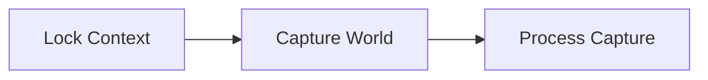
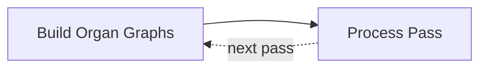
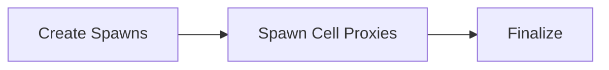

import DocCardList from '@theme/DocCardList';

# Architecture

How an assembly operation actually runs, for contributors and anyone extending the pipeline. Everything here is **internal** — none of it is Blueprint-exposed, and none of it is needed to *use* World Assembly. For that, start at the [plugin overview](../index.mdx).

## The Shape Of A Run

An [Assembly Operation](../types/assembly-operation.md) is a coordinator, not a worker. Once its context is locked it hands the actual work to a task graph, which moves through **three phases**.

**1 · Prepare** — the only phase that reads the live world.

It ends with a snapshot, and everything after it works from that copy.

**2 · Build** — where generation actually happens.

The only phase that repeats, once per generation pass. Organ builds fan out to one task per activated organ, and each pass's collection publishes its cells as collision — which is what makes phased organs compose rather than overlap.

**3 · Place** — the only phase that touches the real world again.

Two ideas explain most of the design:

**Nothing touches the live world until the end.** Generation runs against a *virtual* representation — cell bounds, hulls, and voxel data read from side-car assets — so the expensive part never loads a level. Real content only appears in the [Spawn Cell Proxies](tasks.md) stage, and even then as [proxies](../types/cell-proxy.md) that stream their levels in behind a preview mesh.

**The game thread is a scarce resource.** The graph builder runs off-thread, which is why the pipeline snapshots what it needs into contexts up front rather than reaching into the [Registry](../types/world-assembly-registry.md) — that registry is game-thread only. Only three of the seven [task-graph jobs](tasks.md#the-jobs) are pinned to the game thread, and [each for a concrete engine reason](tasks.md#why-the-game-thread-jobs-are-pinned).

## Cancelling

Cancellation is **cooperative, not pre-emptive**. `Cancel()` sets a flag; in-flight tasks poll it at their loop boundaries and bail early, and the spawn pass stops producing proxies at its next time-slice boundary. Nothing is interrupted mid-operation and nothing already placed is unwound — see [Task Graph](task-graph.md#cancellation).

## Determinism

Every placement decision is drawn from a seeded [Mersenne Twister](../../core/types/math/mersenne-twister.md) stream. That is what makes a seed reproducible, and it is also why several APIs insist on sorted input — the *order* decisions are made in is part of the result. Where a contract depends on ordering, the page for that stage says so.

Each organ draws from its own stream, seeded off the operation's, and the state its successful attempt *started from* is recorded back onto its [Organ Component](../types/organ-component.md) on the game thread once the graph drains — see [Retry](organ-graph.md#retry).

<DocCardList />
