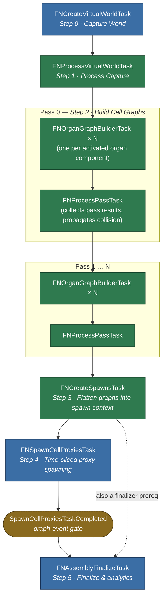

# Tasks

The work an [Assembly Operation](../types/assembly-operation.md) actually performs, split into task-graph jobs. Each is an internal native struct or class under `Assembly/Tasks/`; none is Blueprint-exposed.

The single most important property of this set is **which thread each job runs on**, because that is what decides how much of a generation run can happen off the game thread.

## The Jobs

| Task | Thread | Purpose |
| :-- | :-- | :-- |
| `FNCreateVirtualWorldTask` | **Game thread** | Snapshots the target world into a virtual world context. |
| `FNProcessVirtualWorldTask` | Any worker | Transforms that snapshot into the form the collision checks expect. |
| `FNOrganGraphBuilderTask` | Background worker | Builds the assembly graph for one organ. |
| `FNProcessPassTask` | Any worker | Promotes a pass's graphs to the top-level context and publishes their hulls. |
| `FNCreateSpawnsTask` | Any worker | Flattens per-organ graphs into a single cell-node spawn list. |
| `FNSpawnCellProxiesTask` | **Game thread** | Spawns [Cell Proxy](../types/cell-proxy.md) actors, time-sliced. |
| `FNAssemblyFinalizeTask` | **Game thread** | Notifies the operation the graph has drained. |

Only three are pinned to the game thread, and each for a concrete engine reason rather than convenience.

## Why The Game-Thread Jobs Are Pinned

**`FNCreateVirtualWorldTask`** walks live `AActor`s to gather their simple-collision meshes and transforms. Those queries are not safe from a worker thread, so the snapshot must be taken on the game thread — which is precisely why it is a *snapshot*. Everything downstream reads the copy.

It also filters as it gathers, and the filter is part structural and part authored:

| Excluded | By |
| :-- | :-- |
| Every `AVolume` | Structural. Volumes are *inputs* to generation — organ bounds, exclusions — not collision to avoid. |
| Every `ANDebugActor` | Structural. Debug visualisation is not world geometry. |
| Actors tagged [`NWorldCollision_Ignore`](../tagging.md#world-collision-markup-tags) | Structural. The per-actor opt-out. |
| Actors carrying any configured [`Actor Ignore Tags`](../project-settings.md#assembly) entry | Project setting; empty by default. |
| Actors with collision disabled | [`Exclude Non-Collision Enabled Actors`](../project-settings.md#assembly); `true` by default. |

The distinction matters because the structural exclusions cannot be overridden — a level designer cannot make an organ volume act as collision by tagging it — while the settings-driven ones are the knobs for tuning what a given project treats as an obstacle.

Player starts run the other way: [`Include Player Starts`](../project-settings.md#assembly) is `true` by default, so they are captured *as* collision and generation places cells around them rather than on top of them.

**`FNSpawnCellProxiesTask`** spawns actors, which the engine only permits on the game thread. It drains a **time-sliced batch** per invocation rather than all pending nodes, and signals its completion event once the spawn context's cursor reaches the end of the list. That is what keeps a large generation from stalling a frame.

**`FNAssemblyFinalizeTask`** fires the operation's completion delegates and unlinks the task-graph context. Delegates may reach into gameplay or UI, so it runs where that is safe.

## The Off-Thread Work

`FNOrganGraphBuilderTask` is where generation actually happens. It builds one organ's graph using the **Frontier model** — expanding outward from each bone, consuming open junctions, until none remain or the organ's bounds or cell limits are hit. One task per organ, so independent organs build in parallel.

A builder is only created for components whose `SourceComponent->bActivated` is true — an inactive organ is skipped entirely rather than built and discarded. A pass containing nothing but inactive components still increments the pass counter but adds no tasks to the graph.

A build that succeeds also writes two things back into the [task-graph context](task-graph.md#task-graph-context) keyed by its organ's identifier: the cell count it produced, and the **random-stream state its successful attempt started from**. Both are drained back onto the source [Organ Component](../types/organ-component.md) on the game thread once the graph completes, which is what lets an organ report what it generated without the game thread ever reaching into the build.

The saved state is the *winning attempt's* starting point, not the stream's final position — the stream runs continuously across retries, so replaying from there reproduces the graph that shipped without re-running the attempts that failed.

`FNProcessPassTask` runs between passes: it moves the graphs a pass produced up to the top-level context and adds their cell hulls to the world context, so the *next* pass treats already-placed cells as collision. That is what makes phased organs compose rather than overlap. It also merges the pass's accumulated [context tags and tag counters](../tagging.md) upward, so a later pass's `CheckGraph` sees what earlier passes contributed.

:::warning[Concurrency contract]

`FNCreateSpawnsTask` runs on any worker, and **multiple operations may run their own instance concurrently**. Anything shared it touches must be thread-safe. If you extend this stage, assume another operation is executing the same code beside you — the per-operation state it writes is safe precisely because it is per-operation.

:::

### Cancellation

Cancellation is **cooperative**. Nothing kills a task in flight; two flags are set and the stages notice them at safe points:

| Flag | Set by | Noticed by |
| :-- | :-- | :-- |
| The task-graph context's cancel flag | `FNAssemblyTaskGraph::Cancel()` | Worker stages — organ builders and pass collectors — polling `IsCancelled()` at their loop boundaries. |
| The spawn context's `bCancelled` | The same call | `FNSpawnCellProxiesTask`, at its next **time-slice boundary**. |

The consequence worth internalising: a cancelled operation still runs its remaining tasks to completion, they simply do very little. **Cancelling is not a rollback** — cells already spawned stay in the world, and the cancel call drops the context's references to them rather than destroying them.

## Ordering

The dependency chain is linear at the level of stages, even though organ builds fan out within one and passes repeat:

Node colour follows the thread column above — game thread and any worker.

Two details the shape alone does not show:

- **Passes chain on the collector, not the builders.** Each pass's organ builders depend on the *previous* pass's `FNProcessPassTask` rather than on its builders, so that pass's collision data is fully propagated into the shared `FNVirtualWorldContext` before any builder reads `NodeCollisionMeshes`.
- **A graph event gates finalize, not the spawn task.** `SpawnCellProxiesTaskCompleted` is a manually-fired `FGraphEvent` that `FNSpawnCellProxiesTask` triggers once its time-sliced work drains. That event is what releases `FNAssemblyFinalizeTask` — the dispatcher task completing is not sufficient on its own. `FNCreateSpawnsTask` is separately a finalizer prerequisite.

See [Analytics](analytics.md) for the timing each stage records.
